# ***Data Quality Framework*** - Guida

## 📑 Indice

### 📦 [0. Installazione e Deployment](#0-installazione-e-deployment)
   - [0.1 Requisiti di Sistema](#01-requisiti-di-sistema)
   - [0.2 Package di Distribuzione](#02-package-di-distribuzione)
   - [0.3 Struttura Directory del Binario](#03-struttura-directory-del-binario)
   - [0.4 Procedura di Installazione](#04-procedura-di-installazione)
      - [0.4.1 Installazione su Windows](#041-installazione-su-windows)
      - [0.4.2 Installazione su Linux](#042-installazione-su-linux)
   - [0.5 Verifica Installazione](#05-verifica-installazione)
   - [0.6 Troubleshooting Deployment](#06-troubleshooting-deployment)

### 📖 [1. Introduzione e Panoramica](#1-introduzione-e-panoramica)
   - [1.1 Architettura ad alto livello](#11-architettura-ad-alto-livello)
   - [1.2 Dettaglio funzionamento](#12-dettaglio-funzionamento)
   - [1.3 Pattern matching e selezione file](#13-pattern-matching-e-selezione-file)
   - [1.4 Invocazione ed Esecuzione](#14-invocazione-ed-esecuzione)
      - [1.4.1 Sintassi Comando](#141-sintassi-comando)
      - [1.4.2 Gestione Errori Invocazione](#142-gestione-errori-invocazione)
      - [1.4.3 Risoluzione Configurazione Flusso](#143-risoluzione-configurazione-flusso)
      - [1.4.4 Flusso Completo di Avvio](#144-flusso-completo-di-avvio)

### 🗂️ [2. Configurazione ***Data Quality Framework***](#2-configurazione-data-quality-framework)
   - [2.1 File di Configurazione Sistema e Flusso](#21-file-di-configurazione-sistema-e-flusso)
      - [2.1.1 Gerarchia e Risoluzione Parametri](#211-gerarchia-e-risoluzione-parametri)
      - [2.1.2 Parametri di Configurazione](#212-parametri-di-configurazione)
      - [2.1.3 Mapping Flussi nel File di Sistema](#213-mapping-flussi-nel-file-di-sistema)
   - [2.2 File di Tracciato (.csv)](#22-file-di-tracciato-csv)
      - [2.2.1 Struttura File Tracciato](#221-struttura-file-tracciato)
      - [2.2.2 Tipi di Controllo e Combinazioni](#222-tipi-di-controllo-e-combinazioni)
      - [2.2.3 Esempio Annotato](#223-esempio-annotato)
   - [2.3 Workflow Configurazione End-to-End](#23-workflow-configurazione-end-to-end)
      - [2.3.1 Checklist Configurazione Nuovo Flusso](#231-checklist-configurazione-nuovo-flusso)
      - [2.3.2 Diagramma Relazionale Configurazione](#232-diagramma-relazionale-configurazione)

### 📤 [3. Flussi di Output](#3-flussi-di-output)
   - [3.1 File di Scarto (.ko)](#31-file-di-scarto-ko)
      - [3.1.1 Struttura del File di Scarto](#311-struttura-del-file-di-scarto)
      - [3.1.2 Esempio File CSV](#312-esempio-file-csv)
      - [3.1.3 Esempio File FIXED](#313-esempio-file-fixed-fixed-width)
      - [3.1.4 Utilizzo Operativo](#314-utilizzo-operativo)
   - [3.2 Anagrafica Codici Errore (.codici)](#32-anagrafica-codici-errore-codici)
      - [3.2.1 Struttura del File](#321-struttura-del-file)
      - [3.2.2 Utilizzo Operativo](#322-utilizzo-operativo)
   - [3.3 Report Statistiche (.stats)](#33-report-statistiche-stats)
      - [3.3.1 Struttura del Report](#331-struttura-del-report)
      - [3.3.2 Esempio Report Reale](#332-esempio-report-reale)
      - [3.3.3 Utilizzo Operativo](#333-utilizzo-operativo)
   - [3.4 File di Log](#34-file-di-log)
      - [3.4.1 Struttura del Log](#341-struttura-del-log)
      - [3.4.2 Contenuto del Log](#342-contenuto-del-log)
      - [3.4.3 Livelli di Logging](#343-livelli-di-logging)
      - [3.4.4 Esempio Log Completo](#344-esempio-log-completo-estratto-reale)
      - [3.4.5 Utilizzo Operativo](#345-utilizzo-operativo)

---

## 📦 0. Installazione e Deployment

Il ***Data Quality Framework*** viene distribuito come **eseguibile binario standalone** per le piattaforme **Windows** e **Linux**, consentendo l'esecuzione su sistemi target **senza richiedere l'installazione di Python** o librerie esterne.

Questa sezione descrive i requisiti di sistema, la struttura del package di distribuzione, la procedura di installazione e la verifica del corretto funzionamento del framework.

---

### 0.1 Requisiti di Sistema

Il framework è stato progettato per operare su sistemi enterprise con i seguenti requisiti minimi:

#### **Requisiti Hardware**

| Componente | Requisito Minimo | Requisito Consigliato |
|------------|------------------|----------------------|
| **CPU** | 2 core | 4+ core (per elaborazione multi-worker) |
| **RAM** | 2 GB | 4 GB (per file >500MB) |
| **Disco** | 1 GB liberi | 10 GB liberi (per log e output) |
| **I/O Disco** | Standard HDD | SSD (per file >1GB) |

#### **Requisiti Software**

| Piattaforma | Versione Sistema Operativo | Note |
|-------------|---------------------------|------|
| **Windows** | Windows Server 2012 R2+ <br/> Windows 10+ | Eseguibile nativo .exe |
| **Linux** | RHEL 7+ / CentOS 7+ <br/> Ubuntu 18.04+ <br/> Debian 9+ | Binario ELF64 |

#### **Dipendenze Runtime**

- ✅ **Nessuna dipendenza Python richiesta** sul sistema target
- ✅ **Nessuna libreria esterna** da installare
- ✅ **Binario completamente standalone** con Python embedded

Il framework è stato compilato con **PyInstaller** in modalità **--onefile**, incorporando l'interprete Python 3.9+ e tutte le librerie standard necessarie.

---

### 0.2 Package di Distribuzione

Il framework viene distribuito in **package completi multi-piattaforma** contenenti:
- Script Python eseguibili
- Dati demo completi (CSV e FIXED)
- Script test automatici (Windows + Linux/macOS)
- Configurazioni sistema e flussi
- Documentazione completa (Markdown + HTML)

**Dimensione package:** ~25-30 MB compressi

**Formato distribuzione:**
- **Windows:** `.zip` (estrazione con `Expand-Archive` o tool grafico)
- **Linux/macOS:** `.tar.gz` (estrazione con `tar -xzf`)

**Contenuto Package (identico su tutte le piattaforme):**

```
DataQualityFramework_v1.0.0.zip / .tar.gz
│
├── bin/                               # Script Python eseguibili
│   ├── DataQualityFramework.py        # Entry point principale
│   ├── csv_to_fixed_clienti.py        # Utility conversione
│   └── main.py                        # Alias entry point
│
├── cfg/                               # Configurazioni sistema
│   └── DataQualityFramework.cfg       # Config globale framework
│
├── demo/                              # Dati demo completi
│   ├── csv/                           # Demo CSV con input/output
│   │   ├── cfg/flows/                 # Config flusso CSV
│   │   ├── cfg/layouts/               # Tracciato CSV
│   │   ├── input/pending/             # 3+ file CSV esempio
│   │   └── output/                    # Directory output (4 tipi)
│   │       ├── success/               # .ok files
│   │       ├── error/                 # .ko files
│   │       ├── report/                # .codici files
│   │       └── statistics/            # .stats files
│   │
│   └── fixed/                         # Demo FIXED con input/output
│       ├── cfg/flows/                 # Config flusso FIXED
│       ├── cfg/layouts/               # Tracciato FIXED
│       ├── input/pending/             # 3+ file FIXED esempio
│       ├── output/                    # Directory output (4 tipi)
│       └── archive/                   # File archiviati
│
├── docs/                              # Manuali Markdown
│   └── Data_Quality_Framework_Guida.md     # Guida completa (2100+ righe)
│
├── docs_html/                         # Manuali HTML navigabili
│   └── Data_Quality_Framework_Guida.html   # Versione web della guida
│
├── bat/                               # Script test automatici
│   ├── test_csv.bat                   # Test CSV (Windows)
│   ├── test_fixed.bat                 # Test FIXED (Windows)
│   ├── test_all.bat                   # Suite completa (Windows)
│   ├── test_csv.sh                    # Test CSV (Linux/macOS)
│   ├── test_fixed.sh                  # Test FIXED (Linux/macOS)
│   ├── test_all.sh                    # Suite completa (Linux/macOS)
│   └── README.md                      # Documentazione script test
│
├── log/                               # Directory log (vuota, auto-creata)
│
├── CHANGELOG.md                       # Storia versioni
├── LICENSE                            # Licenza MIT 2025
├── README.md                          # Quick start
├── RELEASE_NOTES.md                   # Note release
└── PRE_RELEASE_CHECKLIST.md           # Checklist pre-release
```

**Differenze per Piattaforma:**

| Aspetto | Windows | Linux/macOS |
|---------|---------|-------------|
| **Formato archive** | `.zip` | `.tar.gz` |
| **Line endings** | CRLF (`\r\n`) | LF (`\n`) |
| **Script esecuzione** | `.bat` funzionanti | `.sh` funzionanti (con `chmod +x`) |
| **Comando Python** | `python` | `python3` |
| **Path separator** | `\` (backslash) | `/` (forward slash) |
| **Contenuto files** | ✅ Identico | ✅ Identico |

**Nota Importante:** Il contenuto del package (file Python, dati demo, configurazioni, documentazione) è **identico** su tutte le piattaforme. Le uniche differenze sono:
- Formato compressione dell'archivio
- Line endings dei file di testo
- Script test (.bat per Windows, .sh per Linux/macOS già inclusi in entrambi i package)

**Cosa Include il Package:**

- ✅ **Script Python** completi (bin/)
- ✅ **Dati Demo** funzionanti (demo/csv/, demo/fixed/)
- ✅ **Script Test** per entrambe le piattaforme (bat/*.bat + bat/*.sh)
- ✅ **Configurazioni** sistema e flussi (cfg/)
- ✅ **Documentazione** completa Markdown + HTML (docs/, docs_html/)
- ✅ **File Release** (CHANGELOG, LICENSE, README, RELEASE_NOTES, PRE_RELEASE_CHECKLIST)

**Cosa NON Include:**

- 🚫 Directory `.git/` (repository Git)
- 🚫 Directory `.vscode/` (impostazioni IDE)
- 🚫 Directory `lib/` (librerie sviluppo - non necessarie)
- 🚫 Directory `utility/` (tool build e conversione - solo per sviluppatori)
- 🚫 File temporanei `.pyc`, `__pycache__/`
- 🚫 Log precedenti (log/ vuota in distribuzione)

---

### 0.3 Struttura Directory del Package

Il package rilasciato presenta la seguente struttura completa con tutte le directory e file distribuiti:

```
DataQualityFramework/                 # Directory root installazione
│
├── 🔵 bin/                           # BINARI ESEGUIBILI
│   ├── DataQualityFramework.py       # Script principale Python
│   ├── csv_to_fixed_clienti.py       # Utility conversione CSV→FIXED
│   ├── DataQualityFramework.py       # Entry point applicazione
│   └── main.py                       # Main script (alias)
│
├── ⚙️ cfg/                           # CONFIGURAZIONI SISTEMA
│   └── DataQualityFramework.cfg      # Config globale (paths, logging, defaults)
│
├── 📁 demo/                          # ESEMPI DEMO FUNZIONANTI
│   │
│   ├── csv/                          # Demo validazione CSV
│   │   ├── cfg/
│   │   │   ├── flows/
│   │   │   │   └── dipendenti_csv.cfg         # Config flusso demo CSV
│   │   │   └── layouts/
│   │   │       ├── dipendenti_csv_layout.csv  # Tracciato demo CSV
│   │   │       └── README.md                  # Documentazione layout
│   │   │
│   │   ├── input/
│   │   │   ├── pending/               # File CSV da elaborare
│   │   │   │   ├── dipendenti_csv_20251101.csv
│   │   │   │   ├── dipendenti_csv_20251102.csv
│   │   │   │   └── dipendenti_csv_20251103.csv
│   │   │   └── skipped/               # File saltati (se configurato)
│   │   │
│   │   └── output/                    # OUTPUT ELABORAZIONI DEMO
│   │       ├── success/               # File validati (.ok)
│   │       ├── error/                 # File scartati (.ko)
│   │       ├── report/                # Anagrafica errori (.codici)
│   │       └── statistics/            # Report statistiche (.stats)
│   │
│   └── fixed/                         # Demo validazione FIXED
│       ├── cfg/
│       │   ├── flows/
│       │   │   └── dipendenti_fixed.cfg       # Config flusso demo FIXED
│       │   └── layouts/
│       │       └── dipendenti_fixed_layout.csv # Tracciato demo FIXED
│       │
│       ├── input/
│       │   ├── pending/               # File FIXED da elaborare
│       │   │   ├── dipendenti_fixed_20251101.dat
│       │   │   ├── dipendenti_fixed_20251102.dat
│       │   │   └── dipendenti_fixed_20251103.dat
│       │   └── skipped/               # File saltati (se configurato)
│       │
│       ├── output/                    # OUTPUT ELABORAZIONI DEMO
│       │   ├── success/               # File validati (.ok)
│       │   ├── error/                 # File scartati (.ko)
│       │   ├── report/                # Anagrafica errori (.codici)
│       │   └── statistics/            # Report statistiche (.stats)
│       │
│       └── archive/                   # File archiviati (demo)
│
├── 📄 docs/                          # DOCUMENTAZIONE COMPLETA
│   └── Data_Quality_Framework_Guida.md       # Manuale completo (2100+ righe)
│
├── 🌐 docs_html/                     # DOCUMENTAZIONE HTML
│   └── Data_Quality_Framework_Guida.html     # Versione web della guida completa
│
├── 📝 log/                           # LOG RUNTIME (auto-generati)
│   └── *.log                          # File log elaborazioni timestampati
│
├── 🧪 bat/                           # SCRIPT TEST AUTOMATICI
│   ├── test_csv.bat                   # Test validazione CSV (Windows)
│   ├── test_fixed.bat                 # Test validazione FIXED (Windows)
│   ├── test_all.bat                   # Test suite completa (Windows)
│   ├── test_csv.sh                    # Test validazione CSV (Linux/macOS)
│   ├── test_fixed.sh                  # Test validazione FIXED (Linux/macOS)
│   ├── test_all.sh                    # Test suite completa (Linux/macOS)
│   └── README.md                      # Documentazione script test
│
├──  CHANGELOG.md                    # Storia completa versioni
├── 📜 LICENSE                         # Licenza MIT 2025
├── 📖 README.md                       # Quick start e panoramica
├── 📝 RELEASE_NOTES.md                # Note release v1.0.0
└── ✅ PRE_RELEASE_CHECKLIST.md        # Checklist pre-pubblicazione
```

**Componenti del Package:**

| Directory | Tipo | Contenuto | Note |
|-----------|------|-----------|------|
| `bin/` | **Eseguibili** | Script Python principali | Entry point applicazione |
| `cfg/` | **Configurazione** | File `.cfg` sistema | 1 config globale framework |
| `demo/csv/` | **Demo CSV** | Esempio completo validazione CSV | 3 file input + output |
| `demo/fixed/` | **Demo FIXED** | Esempio completo validazione FIXED | 3 file input + output |
| `docs/` | **Manuale MD** | Documentazione Markdown | 1 Guida completa (2100+ righe) |
| `docs_html/` | **Manuale HTML** | Versione web della guida | 1 file HTML navigabile |
| `log/` | **Log Runtime** | File log timestampati | Auto-generati dal framework |
| `bat/` | **Test Scripts** | Script test Windows/Linux/macOS | 6 script + README |

**Directory di Output (create automaticamente):**

Ogni demo include le seguenti sottodirectory di output:

| Directory Output | Estensione File | Descrizione |
|------------------|-----------------|-------------|
| `output/success/` | `.ok` | Record validati con successo |
| `output/error/` | `.ko` | Record scartati con codici errore |
| `output/report/` | `.codici` | Anagrafica errori con conteggi |
| `output/statistics/` | `.stats` | Report statistiche dettagliate |

**Separazione Codice vs Configurazione:**

Il design del framework separa nettamente:

- **CODICE** (`bin/`): Script Python eseguibili (logica business)
- **CONFIGURAZIONE** (`cfg/`, `demo/*/cfg/`): File `.cfg` e tracciati `.csv` modificabili
- **DATI** (`demo/*/input/`, `demo/*/output/`): File input/output gestiti dal framework
- **DOCUMENTAZIONE** (`docs/`, `docs_html/`): Manuali utente completi
- **TEST** (`bat/`): Script test automatici per verifica installazione

Questa architettura permette di:
- ✅ Modificare configurazioni e tracciati senza toccare il codice
- ✅ Versionare separatamente codice, configurazioni e documentazione
- ✅ Testare rapidamente con script automatici (`bat/`)
- ✅ Consultare manuali offline (Markdown e HTML)
- ✅ Eseguire demo funzionanti immediatamente dopo installazione

---

### 0.4 Procedura di Installazione

#### 0.4.1 Installazione su Windows

**Passo 1: Download del Package**

Scaricare il file `DataQualityFramework_v1.0.0_Windows.zip` dal repository.

**Passo 2: Estrazione Files**

```cmd
# Estrarre in una directory dedicata (esempio: C:\DataQualityFramework)
cd C:\
Expand-Archive -Path "DataQualityFramework_v1.0.0_Windows.zip" -DestinationPath "C:\DataQualityFramework"
```

**Passo 3: Verifica Struttura**

```cmd
cd C:\DataQualityFramework
dir /B

# Output atteso:
# bin
# cfg
# demo
# docs
# log
# CHANGELOG.md
# LICENSE
# README.md
```

**Passo 4: (Opzionale) Aggiunta al PATH**

Per eseguire il framework da qualsiasi directory:

```cmd
# Aggiungere al PATH di sistema (richiede privilegi amministratore)
setx PATH "%PATH%;C:\DataQualityFramework\bin" /M
```

**Passo 5: Test Esecuzione**

```cmd
# Test help
C:\DataQualityFramework\bin\DataQualityFramework.exe --help

# Test demo CSV
C:\DataQualityFramework\bin\DataQualityFramework.exe DIPENDENTI_CSV

# Test demo FIXED
C:\DataQualityFramework\bin\DataQualityFramework.exe DIPENDENTI_FIXED
```

---

#### 0.4.2 Installazione su Linux

**Passo 1: Download del Package**

```bash
# Download in directory temporanea
cd /tmp
wget https://github.com/tuorepository/DataQualityFramework/releases/download/v1.0.0/DataQualityFramework_v1.0.0_Linux.tar.gz
```

**Passo 2: Estrazione Files**

```bash
# Estrazione in directory opt (raccomandato per software enterprise)
sudo mkdir -p /opt/DataQualityFramework
sudo tar -xzf DataQualityFramework_v1.0.0_Linux.tar.gz -C /opt/DataQualityFramework
```

**Passo 3: Permessi Esecuzione**

```bash
# Rendere eseguibile il binario
sudo chmod +x /opt/DataQualityFramework/bin/DataQualityFramework
```

**Passo 4: (Opzionale) Link Simbolico**

Per eseguire il framework da qualsiasi directory:

```bash
# Creare link simbolico in /usr/local/bin
sudo ln -s /opt/DataQualityFramework/bin/DataQualityFramework /usr/local/bin/dataqualityframework
```

**Passo 5: Verifica Permessi Directory**

```bash
# Verificare che l'utente abbia permessi su cfg/ e log/
cd /opt/DataQualityFramework
ls -la

# Se necessario, modificare ownership
sudo chown -R utente:gruppo /opt/DataQualityFramework
```

**Passo 6: Test Esecuzione**

```bash
# Test help
/opt/DataQualityFramework/bin/DataQualityFramework --help

# Test demo CSV
/opt/DataQualityFramework/bin/DataQualityFramework DIPENDENTI_CSV

# Test demo FIXED
/opt/DataQualityFramework/bin/DataQualityFramework DIPENDENTI_FIXED
```

---

### 0.5 Verifica Installazione

Dopo l'installazione, eseguire i seguenti controlli per verificare il corretto funzionamento:

#### **Test 1: Verifica Help**

```bash
# Windows
C:\DataQualityFramework\bin\DataQualityFramework.exe --help

# Linux
/opt/DataQualityFramework/bin/DataQualityFramework --help
```

**Output Atteso:**

```
Data Quality Framework v1.0.0

Utilizzo: DataQualityFramework <NOME_FLUSSO>

Argomenti:
  NOME_FLUSSO    Nome del flusso da elaborare (es: DIPENDENTI_CSV)

Opzioni:
  --help         Mostra questo messaggio
  --version      Mostra versione framework

Esempi:
  DataQualityFramework DIPENDENTI_CSV
  DataQualityFramework ANAGRAFICA_CLIENTI
```

#### **Test 2: Elaborazione Demo CSV**

```bash
# Windows
cd C:\DataQualityFramework
bin\DataQualityFramework.exe DIPENDENTI_CSV

# Linux
cd /opt/DataQualityFramework
bin/DataQualityFramework DIPENDENTI_CSV
```

**Output Atteso:**

```
═══════════════════════════════════════════════════════════════════════════════
  DATA QUALITY FRAMEWORK v1.0.0 - Avvio Elaborazione
═══════════════════════════════════════════════════════════════════════════════

✅ Configurazione caricata: cfg/DataQualityFramework.cfg
✅ Flusso selezionato: DIPENDENTI_CSV
✅ Tracciato caricato: demo/csv/cfg/layouts/dipendenti_csv_layout.csv
✅ File input trovati: 3 file

📊 Elaborazione in corso...

═══════════════════════════════════════════════════════════════════════════════
  ELABORAZIONE COMPLETATA CON SUCCESSO
═══════════════════════════════════════════════════════════════════════════════

📂 Output generati:
   ✅ File validati: demo/csv/output/success/*.ok
   ❌ File scartati: demo/csv/output/error/*.ko
   📋 Codici errore: demo/csv/output/report/*.codici
   📊 Statistiche: demo/csv/output/statistics/*.stats
   📝 Log: log/DataQualityFramework_20251112_143022.log
```

#### **Test 3: Verifica File Output**

```bash
# Windows
dir demo\csv\output\success\*.ok
dir demo\csv\output\error\*.ko
dir demo\csv\output\report\*.codici
dir demo\csv\output\statistics\*.stats

# Linux
ls -lh demo/csv/output/success/*.ok
ls -lh demo/csv/output/error/*.ko
ls -lh demo/csv/output/report/*.codici
ls -lh demo/csv/output/statistics/*.stats
```

**Verifica Contenuto:**

Ogni test deve produrre **4 file** (uno per ciascuna estensione `.ok`, `.ko`, `.codici`, `.stats`).

#### **Test 4: Controllo Log**

```bash
# Windows
type log\DataQualityFramework_*.log | findstr /C:"ERROR" /C:"CRITICAL"

# Linux
grep -E "ERROR|CRITICAL" log/DataQualityFramework_*.log
```

**Risultato Atteso:** Nessun errore CRITICAL (possibili WARNING fisiologici).

---

### 0.6 Troubleshooting Deployment

#### **Problema: "Eseguibile non trovato" (Windows)**

**Sintomo:**
```
'DataQualityFramework.exe' non è riconosciuto come comando interno o esterno
```

**Causa:** Eseguibile non nel PATH o path errato

**Soluzione:**
```cmd
# Utilizzare path assoluto
C:\DataQualityFramework\bin\DataQualityFramework.exe DIPENDENTI_CSV

# Oppure navigare nella directory bin
cd C:\DataQualityFramework\bin
DataQualityFramework.exe DIPENDENTI_CSV
```

---

#### **Problema: "Permission denied" (Linux)**

**Sintomo:**
```bash
bash: /opt/DataQualityFramework/bin/DataQualityFramework: Permission denied
```

**Causa:** Binario non ha permessi di esecuzione

**Soluzione:**
```bash
# Aggiungere permesso esecuzione
sudo chmod +x /opt/DataQualityFramework/bin/DataQualityFramework

# Verificare permessi
ls -l /opt/DataQualityFramework/bin/DataQualityFramework
# Output: -rwxr-xr-x  (la 'x' indica eseguibile)
```

---

#### **Problema: "File di configurazione non trovato"**

**Sintomo:**
```
ERRORE CRITICO: File cfg/DataQualityFramework.cfg non trovato
```

**Causa:** Working directory errata o configurazione mancante

**Soluzione:**
```bash
# Verificare che il comando venga eseguito dalla directory root del framework
# Windows
cd C:\DataQualityFramework
bin\DataQualityFramework.exe DIPENDENTI_CSV

# Linux
cd /opt/DataQualityFramework
bin/DataQualityFramework DIPENDENTI_CSV

# Verificare presenza configurazione
# Windows: dir cfg\DataQualityFramework.cfg
# Linux: ls -l cfg/DataQualityFramework.cfg
```

---

#### **Problema: "Impossibile scrivere log"**

**Sintomo:**
```
ERROR: Unable to create log directory
```

**Causa:** Permessi insufficienti sulla directory `log/`

**Soluzione (Linux):**
```bash
# Verificare ownership directory log
ls -ld /opt/DataQualityFramework/log

# Modificare ownership se necessario
sudo chown -R utente:gruppo /opt/DataQualityFramework/log

# Verificare permessi scrittura
sudo chmod 755 /opt/DataQualityFramework/log
```

**Soluzione (Windows):**
```cmd
# Verificare permessi NTFS sulla cartella log
# Click destro su log/ → Proprietà → Sicurezza → Verifica permessi scrittura per utente corrente
```

---

#### **Problema: "Binario si blocca all'avvio"**

**Sintomo:** Il comando non produce output e rimane bloccato

**Causa:** Possibile conflitto antivirus o firewall

**Soluzione:**
```bash
# Windows: Aggiungere eccezione Windows Defender
Add-MpPreference -ExclusionPath "C:\DataQualityFramework\bin\DataQualityFramework.exe"

# Eseguire in modalità verbose per diagnostica
# (nota: opzione --verbose da implementare in versione futura)
```

---

#### **Problema: "GLIBC version mismatch" (Linux)**

**Sintomo:**
```
./DataQualityFramework: /lib64/libc.so.6: version `GLIBC_2.XX' not found
```

**Causa:** Binario compilato con GLIBC più recente di quella disponibile sul sistema

**Soluzione:**
```bash
# Verificare versione GLIBC sul sistema
ldd --version

# Se GLIBC < 2.17, richiedere binario compilato per versioni legacy
# Oppure eseguire su sistema con GLIBC aggiornata (es: RHEL 7+ / Ubuntu 18.04+)
```

---

**Per supporto tecnico o problemi non coperti da questa guida, consultare:**
- 📖 Documentazione completa: `docs/Data_Quality_Framework_Guida.html`
- 📋 Issue tracker GitHub: `https://github.com/tuorepository/DataQualityFramework/issues`
- 📧 Email supporto: `alberto.robetti@example.com`

---

## �📖 1. Introduzione e Panoramica

Il ***Data Quality Framework*** nasce per rispondere all'esigenza, presente nella maggior parte dei sistemi informativi, di verificare che i flussi dati rispettino specifiche regole di qualità, coerenza e formato.

Questo strumento di validazione automatica consente di verificare la conformità degli attributi che compongono un flusso di dati strutturati (formato CSV delimitato o a lunghezza fissa FIXED), garantendo che solo i record conformi vengano utilizzati nei processi aziendali.

Il framework legge i file di input, esegue il parsing degli attributi e applica regole configurabili per la validazione di ogni riga. Il sistema applica controlli su ciascun attributo del dataset, verificando:

- **Obbligatorietà** - Presenza del valore nei campi definiti come mandatory
- **Conformità di formato** - Aderenza a pattern standard (date, numeri, codici alfanumerici)
- **Appartenenza a domini** - Validazione del valore rispetto a liste di valori ammessi
- **Range di valori** - Verifica che numeri e date rientrino negli intervalli configurati
- **Correttezza formale** - Validazione di codici standardizzati (Codice Fiscale, Partita IVA, IBAN, email)

I record che superano i controlli vengono inseriti in un flusso dedicato, mentre quelli non conformi vengono gestiti separatamente con dettagli sugli errori riscontrati. Il sistema genera inoltre una reportistica che evidenzia il livello di qualità e fornisce statistiche sui dati processati.

Le regole di validazione sono definite e configurate in modo dichiarativo attraverso un file di tracciato in formato CSV, consentendo di modificare i controlli di qualità senza alcun intervento sul codice sorgente del framework.

**Vantaggi della soluzione:**

- **Riutilizzabilità**: non è necessario implementare i controlli ogni volta; il framework può essere utilizzato su diversi flussi e tracciati.
- **Configurabilità**: le regole di controllo sono facilmente adattabili alle esigenze specifiche, senza interventi sul codice.
- **Ridotto effort**: la configurazione e l'adattamento richiedono poco tempo e risorse.
- **Risparmio di tempo**: l'automazione dei controlli accelera i processi di verifica e onboarding dei dati.
- **Sicurezza e affidabilità**: la soluzione garantisce che i controlli siano sempre applicati correttamente, riducendo il rischio di errori.
- **Saving di coding e test**: si riduce la necessità di sviluppare e testare nuove logiche di controllo per ogni flusso.
- **Garanzia sulla qualità del dato**: solo i dati validi alimentano i sistemi aziendali, migliorando la qualità complessiva delle informazioni.

---

### 1.1 Architettura ad alto livello

Questa sezione descrive l'architettura generale del ***Data Quality Framework*** attraverso un diagramma ad alto livello che mostra il flusso completo dei dati: dagli **input** (file dati e configurazioni), attraverso l'**elaborazione** del framework, fino agli **output** prodotti (file validati, scartati, report e log).

Il diagramma seguente illustra i **quattro file di input** necessari all'esecuzione (dati, tracciato, configurazione processo e flusso), il **motore di validazione** centrale che coordina tutte le operazioni, e i **cinque tipi di output** generati automaticamente per ogni elaborazione. Ogni componente è colorato per facilitare la comprensione: input in blu, elaborazione in arancione, output in verde.

Prima di avviare la validazione dei dati, il framework esegue **controlli preliminari sui file di configurazione** per garantire che:
- Tutti i file necessari esistano e siano accessibili
- La struttura del tracciato sia corretta (colonne obbligatorie presenti)
- I parametri di configurazione siano coerenti e validi
- I path delle directory di output siano raggiungibili

Solo dopo il superamento di queste verifiche iniziali, il sistema procede con l'elaborazione record-by-record dei dati applicando le regole di validazione configurate.

```mermaid
flowchart TB
    subgraph input[" "]
        direction TB
        A1["👤 File CSV/FIXED Dati<br/><small>dati da validare</small>"]
        A2["👨‍💼 Tracciato CSV<br/><small>regole di validazione</small>"]
        A3["⚙️ File Configurazione Processo<br/><small>parametri sistema</small>"]
        A4["⚙️ File Configurazione Flusso<br/><small>parametri specifici</small>"]
    end
    
    subgraph framework[" "]
        direction TB
        B["🔧 FRAMEWORK VALIDAZIONE<br/><br/>• Controlli preliminari CFG<br/>• Legge i file<br/>• Applica le regole<br/>• Valida ogni record<br/>• Genera i report"]
    end
    
    subgraph output[" "]
        direction TB
        C1["✅ Record Validi<br/><small>dati certificati (.ok)</small>"]
        C2["❌ Record Scartati<br/><small>con codici errore (.ko)</small>"]
        C3["📋 Lista Codici Errore<br/><small>anagrafica automatica (.codici)</small>"]
        C4["📊 Report Data Quality<br/><small>statistiche validazione (.stats)</small>"]
        C5["📝 Log di Processo<br/><small>dettaglio esecuzione</small>"]
    end
    
    A1 --> B
    A2 --> B
    A3 --> B
    A4 --> B
    
    B --> C1
    B --> C2
    B --> C3
    B --> C4
    B --> C5
    
    style input fill:#e3f2fd,stroke:none
    style framework fill:#fff3e0,stroke:none
    style output fill:#e8f5e9,stroke:none
```



***Figura 1 - Architettura ad alto livello del Data Quality Framework***

**Legenda:**

- 🔵 **Input** (azzurro): File necessari per l'elaborazione
- 🟠 **Elaborazione** (arancione): Processo di validazione
- 🟢 **Output** (verde): File generati automaticamente

La Figura 1 illustra il funzionamento generale del framework: il sistema riceve quattro tipologie di file in ingresso (① file dati CSV o FIXED da validare, ② tracciato CSV che definisce la struttura e le regole di validazione degli attributi, ③ file di configurazione di processo contenente parametri tecnici globali, ④ file di configurazione di flusso con parametri specifici dell'elaborazione), elabora i dati attraverso il motore di validazione centrale (②), e produce cinque tipologie di output (③ file con record validi, ④ file con record scartati e motivazioni, ⑤ anagrafica codici errore rilevati, ⑥ report statistico di sintesi, ⑦ log dettagliato di processo).

### 1.2 Dettaglio funzionamento

Il processo di validazione opera con un meccanismo di **elaborazione sequenziale record-by-record**. Il file dati viene letto riga per riga mantenendo costante il consumo di memoria anche per file di grandi dimensioni. Per ciascuna riga estratta, il framework applica le regole di parsing definite nel **file di configurazione del tracciato**: nel caso di file CSV, gli attributi vengono separati in base al delimitatore configurato (tipicamente virgola, punto-virgola, pipe o tab, ma è possibile specificare qualsiasi carattere mediante il parametro di configurazione), mentre per i file a lunghezza fissa (FIXED), i valori vengono estratti mediante le coordinate di posizione (start/length) specificate nel layout. Una volta isolati i singoli attributi, il sistema esegue in sequenza tutti i controlli di Data Quality configurati per ciascun attributo secondo le regole dichiarate nel tracciato.

Le righe che superano con successo l'intero ciclo di validazioni, senza rilevare alcuna violazione, confluiscono nel **flusso di output delle righe valide**. Al contrario, le righe in cui viene rilevata almeno una non conformità (campo obbligatorio assente, formato incompatibile con il pattern atteso, valore numerico fuori range, data invalida, codice non presente nel dominio ammesso) vengono indirizzate verso il **flusso di scarto**, arricchite con una colonna aggiuntiva contenente i codici errore specifici che identificano puntualmente le violazioni riscontrate.

```mermaid
flowchart LR
    A["📄 Riga"] --> B["🔍 Parsing"]
    B --> C{Controlli<br/>DQ}
    C -->|OK| D["✔️ File OK"]
    C -->|KO| E["❌ File KO"]
    
    style A fill:#e3f2fd,stroke:#1976d2,stroke-width:2px
    style B fill:#fff3e0,stroke:#f57c00,stroke-width:2px
    style C fill:#f3e5f5,stroke:#7b1fa2,stroke-width:2px
    style D fill:#e8f5e9,stroke:#388e3c,stroke-width:2px
    style E fill:#ffebee,stroke:#c62828,stroke-width:2px
```



***Figura 2 - Flusso elaborazione record-by-record***

Al termine dell'elaborazione, il framework produce due dataset completamente distinti e mutuamente esclusivi: il primo contiene esclusivamente i record che hanno superato tutte le validazioni configurate; il secondo raccoglie le righe che non hanno superato i controlli di validazione configurati. Ogni esecuzione genera inoltre un report statistico dettagliato che documenta metriche aggregate di qualità, distribuzione degli errori per tipologia e per campo, percentuali di successo, fornendo agli operatori visibilità completa e quantificabile sull'esito del processo di validazione.

Parallelamente ai file di output, il processo genera automaticamente un **file di log** strutturato che traccia l'intero ciclo di vita dell'elaborazione: caricamento delle configurazioni, controlli preliminari sui file di input, fasi di parsing e validazione con timestamp millisecondi, statistiche di processamento per ciascun file elaborato (numero record validi/scartati, tempo di elaborazione, throughput), eventuali errori di sistema o warning operativi. Il log costituisce uno strumento essenziale per l'auditing delle operazioni, il troubleshooting di anomalie e il monitoraggio delle performance del sistema.

### 1.3 Pattern matching e selezione file

La soluzione è altamente configurabile per quanto riguarda la gestione dei file dati di input, permettendo di elaborare singoli file o insiemi di file con criteri di selezione e ordinamento personalizzati: quando viene applicato un pattern di ricerca (es. `vendite_*.csv`), è possibile elaborare tutti i file che corrispondono al pattern, oppure selezionare solo il primo o solo l'ultimo in base all'ordinamento configurato.

Il framework supporta tre modalità di elaborazione quando vengono rilevati più file corrispondenti a un pattern:

```mermaid
%%{init: {'theme':'base', 'themeVariables': {'fontSize':'14px'}}}%%
flowchart TD
    Start([📁 File presenti<br/>in Directory Input]) --> Files["📄 vendite_20250108.csv<br/>📄 vendite_20250109.csv<br/>📄 vendite_20250110.csv"]
    
    Files --> Pattern[🔍 Pattern Matching<br/>vendite_*.csv<br/>Ordinamento: alfabetico ASC]
    
    Pattern --> Strategy{⚙️ Strategia<br/>di Selezione?}
    
    Strategy -->|① Modalità 1| Mode1[✅ Solo primo file]
    Strategy -->|② Modalità 2| Mode2[✅ Solo ultimo file]
    Strategy -->|③ Modalità 3| Mode3[✅ Tutti i file]
    
    Mode1 --> Result1[📄 vendite_20250108.csv]
    Mode2 --> Result2[📄 vendite_20250110.csv]
    Mode3 --> Result3[📄 vendite_20250108.csv<br/>📄 vendite_20250109.csv<br/>📄 vendite_20250110.csv]
    
    Result1 --> End([🎯 File selezionato<br/>per elaborazione])
    Result2 --> End
    Result3 --> End
    
    style Start fill:#e8f0f7,stroke:#5a7a9b,stroke-width:1.5px,color:#2c3e50
    style Files fill:#f7f0e8,stroke:#9b7a5a,stroke-width:1.5px,color:#2c3e50
    style Pattern fill:#f0e8f7,stroke:#7a5a9b,stroke-width:1.5px,color:#2c3e50
    style Strategy fill:#f7f0e8,stroke:#9b7a5a,stroke-width:1.5px,color:#2c3e50
    style Mode1 fill:#e8f7f0,stroke:#5a9b7a,stroke-width:1.5px,color:#2c3e50
    style Mode2 fill:#e8f7f0,stroke:#5a9b7a,stroke-width:1.5px,color:#2c3e50
    style Mode3 fill:#e8f7f0,stroke:#5a9b7a,stroke-width:1.5px,color:#2c3e50
    style Result1 fill:#ffffff,stroke:#5a9b7a,stroke-width:1.5px,color:#2c3e50
    style Result2 fill:#ffffff,stroke:#5a9b7a,stroke-width:1.5px,color:#2c3e50
    style Result3 fill:#ffffff,stroke:#5a9b7a,stroke-width:1.5px,color:#2c3e50
    style End fill:#e8f7f0,stroke:#5a9b7a,stroke-width:1.5px,color:#2c3e50
    
    linkStyle default stroke:#7f8c8d,stroke-width:1.5px
```



***Figura 3 - Strategie di selezione file con pattern matching***

---

### 1.4 Invocazione ed Esecuzione

Il ***Data Quality Framework*** viene distribuito come **eseguibile standalone** per piattaforme **Windows** e **Linux**, non richiedendo installazione Python sul sistema target. L'esecuzione avviene da riga di comando con un parametro obbligatorio che identifica il flusso di validazione da elaborare.

#### 1.4.1 Sintassi Comando

Il framework viene invocato da riga di comando con la seguente sintassi:

**Windows:**
```cmd
DataQualityFramework.exe <nome_funzionale>
```

**Linux:**
```bash
./DataQualityFramework <nome_funzionale>
```

**Parametri:**

- **nome_funzionale** (obbligatorio): Identificativo del flusso di validazione da elaborare. Deve corrispondere a una chiave configurata nel file di sistema `DataQualityFramework.cfg` nella sezione mapping dei flussi.
  
  > ⚠️ **Nota**: Il parametro è **case-insensitive** - viene automaticamente convertito in maiuscolo dal framework. I valori `dipendenti_csv`, `DIPENDENTI_CSV` e `Dipendenti_Csv` sono equivalenti.

**Esempi di invocazione:**

```bash
# Elaborazione flusso dipendenti in formato CSV (tutte equivalenti)
DataQualityFramework.exe DIPENDENTI_CSV
DataQualityFramework.exe dipendenti_csv
DataQualityFramework.exe Dipendenti_Csv

# Elaborazione anagrafica clienti
DataQualityFramework.exe CLIENTI_ANAGRAFICA  

# Elaborazione fornitori in formato FIXED
DataQualityFramework.exe FORNITORI_FIXED
```

**Visualizzazione help:**

```bash
# Help completo con sintassi ed esempi
DataQualityFramework.exe --help
```

#### 1.4.2 Gestione Errori Invocazione

Il framework implementa controlli rigorosi durante la fase di invocazione per garantire che tutti i prerequisiti siano soddisfatti prima di avviare l'elaborazione.

**Mancanza parametro obbligatorio:**

Se l'utente omette il parametro `nome_funzionale`, il framework termina immediatamente con exit code 2 e visualizza un messaggio di errore seguito dall'help completo:

```bash
$ DataQualityFramework.exe

usage: DataQualityFramework.exe [-h] nome_funzionale
DataQualityFramework.exe: error: the following arguments are required: nome_funzionale

Data Quality Framework v1.0.0 - Sistema Enterprise per Validazione Dati

Esempi di utilizzo:
  DataQualityFramework.exe TEST_CSV_COMPARATIVO
  DataQualityFramework.exe TEST_FIXED_COMPARATIVO
  DataQualityFramework.exe PROD_ANAGRAFICA_CLIENTI
```

**Exit codes:**

Il framework utilizza exit code standard POSIX per facilitare l'integrazione in pipeline automatizzate e sistemi di orchestrazione:

| Exit Code | Significato | Descrizione |
|-----------|-------------|-------------|
| **0** | Successo | Elaborazione completata con successo, tutti i file processati |
| **1** | Errore elaborazione | Errore durante l'elaborazione dati (eccezioni non gestite) |
| **2** | Errore configurazione | Configurazione mancante o non valida (mapping flusso, file .cfg, parametri obbligatori) |

#### 1.4.3 Risoluzione Configurazione Flusso

Una volta validato il parametro da riga di comando, il framework esegue una sequenza di controlli per risolvere la configurazione specifica del flusso richiesto.

**Meccanismo di risoluzione:**

1. **Caricamento configurazione sistema**
   
   Il framework legge il file `cfg/DataQualityFramework.cfg` che contiene:
   - Parametri globali di sistema (PATH_LOG, LOG_LEVEL, ecc.)
   - Mapping dei flussi disponibili (nome_funzionale → path configurazione flusso)

2. **Ricerca mapping flusso**
   
   Cerca una chiave nel file di sistema corrispondente al `nome_funzionale` passato (case-insensitive). Il mapping definisce il path del file di configurazione specifico del flusso.
   
   **Esempio mapping nel file sistema:**
   ```ini
   # File: cfg/DataQualityFramework.cfg
   
   # Mapping flussi disponibili
   DIPENDENTI_CSV=cfg/flows/dipendenti_csv.cfg
   DIPENDENTI_FIXED=cfg/flows/dipendenti_fixed.cfg
   CLIENTI_ANAGRAFICA=cfg/flows/clienti_anagrafica.cfg
   ```

3. **Verifica esistenza file configurazione flusso**
   
   Verifica che il file di configurazione flusso specificato nel mapping esista fisicamente sul filesystem.

**Gestione errori di risoluzione:**

Il framework implementa controlli CRITICAL con terminazione immediata in caso di problemi:

**Errore 1: Mapping flusso non trovato**

Se il `nome_funzionale` richiesto non è configurato nel file di sistema:

```
[2025-11-12 14:30:15.234] - CRITICAL - ❌ Mapping flusso 'FLUSSO_INESISTENTE' NON trovato nel file di configurazione sistema
[2025-11-12 14:30:15.235] - CRITICAL -    File configurazione: C:\Python\cfg\DataQualityFramework.cfg
[2025-11-12 14:30:15.236] - CRITICAL -    Flussi disponibili nel file sistema:
[2025-11-12 14:30:15.237] - CRITICAL -      • DIPENDENTI_CSV → cfg/flows/dipendenti_csv.cfg
[2025-11-12 14:30:15.238] - CRITICAL -      • DIPENDENTI_FIXED → cfg/flows/dipendenti_fixed.cfg
[2025-11-12 14:30:15.239] - CRITICAL -      • CLIENTI_ANAGRAFICA → cfg/flows/clienti_anagrafica.cfg
[2025-11-12 14:30:15.240] - CRITICAL -    Fine processo con exit code 2
```

**Errore 2: File configurazione flusso non esiste**

Se il path specificato nel mapping non corrisponde a un file esistente:

```
[2025-11-12 14:32:10.456] - CRITICAL - ❌ File configurazione flusso NON esiste
[2025-11-12 14:32:10.457] - CRITICAL -    Flusso richiesto: DIPENDENTI_CSV
[2025-11-12 14:32:10.458] - CRITICAL -    Path atteso: C:\Python\cfg\flows\dipendenti_csv.cfg
[2025-11-12 14:32:10.459] - CRITICAL -    Path nel mapping: cfg/flows/dipendenti_csv.cfg
[2025-11-12 14:32:10.460] - CRITICAL -    Fine processo con exit code 2
```

**Vantaggi del meccanismo:**

- **Fail-fast**: Errori di configurazione vengono rilevati immediatamente prima dell'elaborazione dati
- **Diagnostica dettagliata**: Log CRITICAL fornisce tutte le informazioni necessarie per risolvere il problema
- **Lista flussi disponibili**: In caso di errore, mostra automaticamente tutti i flussi configurati correttamente
- **Exit code standard**: Permette l'integrazione in script di orchestrazione con gestione errori appropriata
- **Path assoluti nel log**: Facilita la verifica manuale dell'esistenza dei file di configurazione

#### 1.4.4 Flusso Completo di Avvio

Il diagramma seguente illustra l'intero flusso di avvio del framework dalla riga di comando fino all'inizio dell'elaborazione dati:

```mermaid
%%{init: {'theme':'base', 'themeVariables': {'fontSize':'14px'}}}%%
flowchart TD
    Start([👤 Utente esegue<br/>comando]) --> Parse[🔍 Parsing argomenti<br/>riga comando]
    
    Parse --> CheckArg{Parametro<br/>nome_funzionale<br/>presente?}
    
    CheckArg -->|❌ No| ErrorArg[❌ ERRORE PARAMETRI<br/>Mostra usage + help<br/>Exit code 2]
    
    CheckArg -->|✅ Sì| LoadSys[📂 Carica config sistema<br/>DataQualityFramework.cfg]
    
    LoadSys --> CheckMap{Mapping flusso<br/>trovato in<br/>config sistema?}
    
    CheckMap -->|❌ No| ErrorMap[❌ ERRORE CRITICAL<br/>Elenca flussi disponibili<br/>Exit code 2]
    
    CheckMap -->|✅ Sì| CheckFile{File config<br/>flusso esiste<br/>su filesystem?}
    
    CheckFile -->|❌ No| ErrorFile[❌ ERRORE CRITICAL<br/>Mostra path atteso/mapping<br/>Exit code 2]
    
    CheckFile -->|✅ Sì| LoadFlow[📂 Carica config flusso<br/>Merge con config sistema]
    
    LoadFlow --> InitLog[📝 Inizializza logger<br/>con timestamp]
    
    InitLog --> PrintBanner[🎯 Stampa banner<br/>informativo processo]
    
    PrintBanner --> ValidateParams[✔️ Valida parametri<br/>obbligatori merged]
    
    ValidateParams --> StartProc[🚀 Avvio elaborazione<br/>dati validazione]
    
    StartProc --> Success([✅ Processo in esecuzione])
    
    ErrorArg --> End([🛑 Fine processo])
    ErrorMap --> End
    ErrorFile --> End
    
    style Start fill:#e8f0f7,stroke:#5a7a9b,stroke-width:2px,color:#2c3e50
    style Parse fill:#f7f0e8,stroke:#9b7a5a,stroke-width:1.5px,color:#2c3e50
    style CheckArg fill:#fff3e8,stroke:#d9a066,stroke-width:1.5px,color:#2c3e50
    style LoadSys fill:#e8f7f0,stroke:#5a9b7a,stroke-width:1.5px,color:#2c3e50
    style CheckMap fill:#fff3e8,stroke:#d9a066,stroke-width:1.5px,color:#2c3e50
    style CheckFile fill:#fff3e8,stroke:#d9a066,stroke-width:1.5px,color:#2c3e50
    style LoadFlow fill:#e8f7f0,stroke:#5a9b7a,stroke-width:1.5px,color:#2c3e50
    style InitLog fill:#e8f7f0,stroke:#5a9b7a,stroke-width:1.5px,color:#2c3e50
    style PrintBanner fill:#e8f7f0,stroke:#5a9b7a,stroke-width:1.5px,color:#2c3e50
    style ValidateParams fill:#e8f7f0,stroke:#5a9b7a,stroke-width:1.5px,color:#2c3e50
    style StartProc fill:#e8f7f0,stroke:#5a9b7a,stroke-width:1.5px,color:#2c3e50
    style Success fill:#d4edda,stroke:#28a745,stroke-width:2px,color:#155724
    style ErrorArg fill:#f8d7da,stroke:#dc3545,stroke-width:2px,color:#721c24
    style ErrorMap fill:#f8d7da,stroke:#dc3545,stroke-width:2px,color:#721c24
    style ErrorFile fill:#f8d7da,stroke:#dc3545,stroke-width:2px,color:#721c24
    style End fill:#e2e3e5,stroke:#6c757d,stroke-width:2px,color:#383d41
    
    linkStyle default stroke:#7f8c8d,stroke-width:1.5px
```



***Figura 4 - Flusso completo di avvio e controlli preliminari***

---

## 🗂️ 2. Configurazione ***Data Quality Framework***

Il ***Data Quality Framework*** adotta un approccio di configurazione **dichiarativo** basato su file esterni, eliminando la necessità di modificare il codice sorgente per adattare il comportamento del sistema alle specifiche esigenze di ogni flusso di validazione. La configurazione si articola su tre tipologie di file complementari, ciascuno con uno scopo specifico e ben definito nella gerarchia del sistema.

Il framework riconosce e gestisce **tre livelli di configurazione**:

1. **Configurazione di Sistema** (`DataQualityFramework.cfg`) - Parametri globali che si applicano a tutti i flussi, inclusa la directory dei log, il livello di logging generale e il mapping che associa ogni identificativo di flusso al relativo file di configurazione specifica.

2. **Configurazione di Flusso** (es. `dipendenti_csv.cfg`) - Parametri specifici per un singolo flusso di validazione, quali i percorsi dei file di input/output, le impostazioni di parsing CSV o FIXED, e le opzioni di elaborazione batch. Quando un parametro è definito sia nel file di sistema che nel file di flusso, **il valore del flusso ha priorità assoluta**, consentendo personalizzazioni granulari senza impattare altri flussi.

3. **Tracciato di Validazione** (es. `layout_dipendenti.csv`) - Definizione strutturata degli attributi del dataset e delle regole di validazione da applicare a ciascun campo, espressa in formato tabellare CSV per massima leggibilità e manutenibilità.

Questa architettura a tre livelli garantisce **separazione delle responsabilità**, **riutilizzabilità delle configurazioni** e **flessibilità nella gestione di scenari eterogenei**, permettendo di mantenere parametri comuni centralizzati mentre ogni flusso preserva le proprie specificità operative.

---

### 2.1 File di Configurazione Sistema e Flusso (.cfg)

I file di configurazione utilizzano il formato **INI** standard, caratterizzato da coppie chiave-valore organizzate in sezioni opzionali. Due file distinti condividono questa struttura ma servono scopi complementari:

- **File di Sistema** (`DataQualityFramework.cfg`): Contiene parametri globali validi per tutte le esecuzioni del framework, quali la directory base dei log, il livello di logging predefinito, e soprattutto il **mapping dei flussi** che associa ogni identificativo funzionale (es. `DIPENDENTI_CSV`) al percorso assoluto del rispettivo file di configurazione specifica.

- **File di Flusso** (es. `dipendenti_csv.cfg`): Definisce parametri operativi specifici per un singolo flusso di validazione, inclusi i percorsi dei file di input/output, le impostazioni di parsing formato-specifiche (CSV vs FIXED), i parametri di pattern matching per elaborazioni batch, e il riferimento al tracciato di validazione da applicare.

#### 2.1.1 Gerarchia e Risoluzione Parametri

Il framework implementa un **meccanismo di risoluzione gerarchica a tre livelli** per determinare il valore effettivo di ogni parametro:

**Priorità 1 - FLUSSO (🥇 Massima):** Se il parametro è definito nel file di configurazione specifico del flusso, questo valore viene utilizzato **incondizionatamente**, ignorando eventuali definizioni nei livelli inferiori.

**Priorità 2 - SISTEMA (🥈 Media):** Se il parametro non è presente nel file di flusso ma è definito nel file di sistema `DataQualityFramework.cfg`, viene utilizzato il valore del file di sistema. Questo permette di definire **default condivisi** tra più flussi.

**Priorità 3 - DEFAULT (🥉 Bassa):** Se il parametro non è specificato né nel flusso né nel sistema, il framework utilizza un valore predefinito **hardcoded** nel codice sorgente, garantendo robustezza anche in assenza di configurazione esplicita.

**Errore CRITICAL:** Per parametri obbligatori privi di default (es. `DQ_FILE_TRACCIATO`, `DQ_FILE_TO_WORK`), se non sono definiti in alcuno dei tre livelli, il framework termina immediatamente con **exit code 2** e un messaggio di log CRITICAL che elenca i parametri mancanti.

**Diagramma flusso decisionale:**

```mermaid
%%{init: {'theme':'base', 'themeVariables': {'fontSize':'14px'}, 'flowchart': {'htmlLabels': true, 'curve': 'linear'}}}%%
flowchart TD
    Start([🔧 Framework cerca<br/>parametro X]) --> CheckFlusso{Parametro X<br/>presente in<br/>File FLUSSO?}
    
    CheckFlusso -- ✅ Sì --> UsaFlusso[✅ USA VALORE FLUSSO<br/>Priorità: 🥇 MASSIMA]
    CheckFlusso -- ❌ No --> CheckProcesso{Parametro X<br/>presente in<br/>File PROCESSO?}
    
    CheckProcesso -- ✅ Sì --> UsaProcesso[⚙️ USA VALORE PROCESSO<br/>Priorità: 🥈 MEDIA]
    CheckProcesso -- ❌ No --> CheckDefault{Parametro X<br/>ha valore<br/>DEFAULT<br/>nel codice?}
    
    CheckDefault -- ✅ Sì --> UsaDefault[🔹 USA VALORE DEFAULT<br/>Priorità: 🥉 BASSA]
    CheckDefault -- ❌ No --> Errore[❌ ERRORE CRITICAL<br/>Parametro obbligatorio<br/>mancante<br/>Exit code 2]
    
    UsaFlusso --> Fine([🎯 Valore finale<br/>determinato])
    UsaProcesso --> Fine
    UsaDefault --> Fine
    
    Errore --> Stop([🛑 STOP<br/>Processo terminato])
    
    style Start fill:#e8f0f7,stroke:#5a7a9b,stroke-width:1.5px,color:#2c3e50
    style CheckFlusso fill:#f7f0e8,stroke:#9b7a5a,stroke-width:1.5px,color:#2c3e50
    style CheckProcesso fill:#f7f0e8,stroke:#9b7a5a,stroke-width:1.5px,color:#2c3e50
    style CheckDefault fill:#f7f0e8,stroke:#9b7a5a,stroke-width:1.5px,color:#2c3e50
    style UsaFlusso fill:#e8f7f0,stroke:#5a9b7a,stroke-width:2px,color:#2c3e50
    style UsaProcesso fill:#f7f5e8,stroke:#9b8f5a,stroke-width:1.5px,color:#2c3e50
    style UsaDefault fill:#e8f0f7,stroke:#5a7a9b,stroke-width:1.5px,color:#2c3e50
    style Errore fill:#f7e8e8,stroke:#9b5a5a,stroke-width:2px,color:#2c3e50
    style Fine fill:#e8f7f0,stroke:#5a9b7a,stroke-width:1.5px,color:#2c3e50
    style Stop fill:#f7e8e8,stroke:#9b5a5a,stroke-width:1.5px,color:#2c3e50
    
    linkStyle 0 stroke:#7f8c8d,stroke-width:1.5px
    linkStyle 1 stroke:#5a9b7a,stroke-width:1.5px,color:#2c3e50
    linkStyle 2 stroke:#9b7a5a,stroke-width:1.5px,color:#2c3e50
    linkStyle 3 stroke:#9b8f5a,stroke-width:1.5px,color:#2c3e50
    linkStyle 4 stroke:#9b7a5a,stroke-width:1.5px,color:#2c3e50
    linkStyle 5 stroke:#5a7a9b,stroke-width:1.5px,color:#2c3e50
    linkStyle 6 stroke:#9b5a5a,stroke-width:1.5px,color:#2c3e50
    linkStyle 7 stroke:#5a9b7a,stroke-width:1.5px
    linkStyle 8 stroke:#5a9b7a,stroke-width:1.5px
    linkStyle 9 stroke:#5a9b7a,stroke-width:1.5px
    linkStyle 10 stroke:#9b5a5a,stroke-width:1.5px
```



***Figura 4 - Logica di risoluzione priorità parametri***

---

**Legenda priorità:**

- 🥇 **PRIORITÀ 1 - FLUSSO**: Verde scuro  
  Valore specifico per quel CSV. Se presente, **sovrascrive tutto** (PROCESSO e DEFAULT ignorati).

- 🥈 **PRIORITÀ 2 - PROCESSO**: Giallo  
  Valore globale per tutti i CSV. Usato solo se **assente nel FLUSSO**.

- 🥉 **PRIORITÀ 3 - DEFAULT**: Giallo chiaro  
  Valore predefinito sicuro hardcoded nel codice. Usato solo se **assente in FLUSSO e PROCESSO**.

- 🚫 **ERRORE**: Rosso  
  Solo per parametri obbligatori (`DQ_FILE_TO_CHECK` o `DQ_FILE_TO_WORK`, `DQ_FILE_TRACCIATO`). Se mancano **in tutti e 3 i livelli**, il framework si ferma con exit code 2.

---

#### 2.1.2 Parametri di Configurazione

Le tabelle seguenti documentano tutti i parametri supportati dal framework, organizzati per categoria funzionale. Ogni parametro è descritto con obbligatorietà, valori di default, sensibilità al case e esempi pratici di utilizzo.

> ⚠️ **IMPORTANTE - Percorsi Assoluti**: Tutti i percorsi specificati nei file di configurazione devono essere **assoluti** per garantire portabilità e prevenire ambiguità durante l'esecuzione. Evitare percorsi relativi che potrebbero essere interpretati diversamente in base alla directory corrente di esecuzione.

##### **📂 Parametri Directory e Percorsi**

| Parametro | Obbl. | Contesto Obbligatorietà | Default | Case Sensitive | Descrizione ed Esempio |
|-----------|-------|------------------------|---------|----------------|------------------------|
| `PATH_LOG` | ❌ No | - | `log/` | ✅ Sì (path) | Directory base contenente i file di log del framework. Ogni esecuzione genera un file log timestampato in questa directory.<br>**Esempio:** `PATH_LOG=C:\DataQuality\logs\`<br>**Nota:** Usare sempre path assoluto |
| `DQ_DIR_TO_SCAN` | ⚠️ Cond | ✅ Obbligatorio per elaborazione batch con pattern matching | - | ✅ Sì (path) | Directory da scansionare per individuare file matching il pattern `DQ_FILE_TO_WORK`<br>**Esempio:** `DQ_DIR_TO_SCAN=C:\DataQuality\input\pending\`<br>**Usato con:** `DQ_FILE_TO_WORK=dipendenti_*.csv` |
| `DQ_FILE_TO_WORK` | ⚠️ Cond | ✅ Obbligatorio se formato=CSV o FIXED | - | ✅ Sì | File singolo o pattern glob per elaborazione batch<br>**File singolo:** `DQ_FILE_TO_WORK=C:\DataQuality\input\dipendenti_20251112.csv`<br>**Pattern:** `DQ_FILE_TO_WORK=dipendenti_*.csv` (richiede `DQ_DIR_TO_SCAN`) |
| `DQ_FILE_TRACCIATO` | ✅ Sì | Sempre obbligatorio | - | ✅ Sì (path) | Path assoluto del file tracciato CSV contenente definizione struttura e regole validazione<br>**Esempio:** `DQ_FILE_TRACCIATO=C:\DataQuality\cfg\layouts\layout_dipendenti.csv` |
| `OUTPUT_DIR_VALID` | ❌ No | - | `output/success/` | ✅ Sì (path) | Directory di destinazione per file validati (.ok)<br>**Esempio:** `OUTPUT_DIR_VALID=C:\DataQuality\output\validated\` |
| `OUTPUT_DIR_ERROR` | ❌ No | - | `output/error/` | ✅ Sì (path) | Directory di destinazione per file scartati (.ko)<br>**Esempio:** `OUTPUT_DIR_ERROR=C:\DataQuality\output\rejected\` |
| `OUTPUT_DIR_REPORTS` | ❌ No | - | `output/report/` | ✅ Sì (path) | Directory di destinazione per anagrafica codici errore (.codici)<br>**Esempio:** `OUTPUT_DIR_REPORTS=C:\DataQuality\output\reports\` |
| `OUTPUT_DIR_STATS` | ❌ No | - | `output/statistics/` | ✅ Sì (path) | Directory di destinazione per report statistiche (.stats)<br>**Esempio:** `OUTPUT_DIR_STATS=C:\DataQuality\output\statistics\` |

##### **🔧 Parametri Logging e Debug**

| Parametro | Obbl. | Contesto Obbligatorietà | Default | Case Sensitive | Descrizione ed Esempio |
|-----------|-------|------------------------|---------|----------------|------------------------|
| `LOG_LEVEL` | ❌ No | - | `INFO` | ❌ No | Livello di dettaglio log. Valori: `DEBUG`, `DEBUG1`, `DEBUG2`, `DEBUG3`, `INFO`, `WARNING`, `ERROR`, `CRITICAL`<br>**Esempio:** `LOG_LEVEL=DEBUG3` (massimo dettaglio per troubleshooting)<br>**Nota:** `debug`, `DEBUG`, `Debug` sono equivalenti |
| `DQ_ENABLE_FIELD_LOGGING` | ❌ No | - | `false` | ❌ No | Abilita logging valore campo per campo durante validazione (impatto performance significativo)<br>**Valori:** `true/false`, `yes/no`, `s/n`, `y/n` (case-insensitive)<br>**Esempio:** `DQ_ENABLE_FIELD_LOGGING=true` |
| `DQ_ENABLE_ROW_LOGGING` | ❌ No | - | `false` | ❌ No | Abilita logging riga completa durante elaborazione<br>**Valori:** `true/false`, `yes/no`, `s/n`, `y/n` (case-insensitive)<br>**Esempio:** `DQ_ENABLE_ROW_LOGGING=yes` |

##### **📊 Parametri CSV**

| Parametro | Obbl. | Contesto Obbligatorietà | Default | Case Sensitive | Descrizione ed Esempio |
|-----------|-------|------------------------|---------|----------------|------------------------|
| `FILE_ENCODING` | ❌ No | - | `utf-8` | ❌ No | Encoding file CSV/FIXED. Valori comuni: `utf-8`, `latin1`, `cp1252`, `iso-8859-1`<br>**Esempio:** `FILE_ENCODING=cp1252` (file Windows legacy)<br>**Nota:** `UTF-8`, `utf-8`, `Utf-8` equivalenti |
| `CSV_FIELD_SEPARATOR` | ❌ No | - | `,` | ✅ Sì | Delimitatore campi CSV (separa colonne tra loro)<br>**Esempio:** `CSV_FIELD_SEPARATOR=;` (punto e virgola)<br>**Nota:** `,` (virgola) ≠ `;` (punto e virgola) - case sensitive |
| `CSV_TEXT_QUALIFIER` | ❌ No | - | `"` | ✅ Sì | Carattere qualificatore testo per valori contenenti il separatore<br>**Esempio:** `CSV_TEXT_QUALIFIER='` (apice singolo invece di doppio apice)<br>**Nota:** `"` (doppio apice) ≠ `'` (apice singolo) |
| `CSV_SKIP_HEADER_ROWS` | ❌ No | - | `1` | N/A (numerico) | Numero righe header da saltare prima dei dati<br>**Esempio:** `CSV_SKIP_HEADER_ROWS=2` (header + riga vuota separatrice) |
| `ERROR_CODES_SEPARATOR` | ❌ No | - | `\|` | ✅ Sì | Separatore tra codici errore nella colonna `DQ_ERROR_CODES` del file di scarto<br>**IMPORTANTE:** Deve essere **diverso** da `CSV_FIELD_SEPARATOR` per evitare collisioni<br>**Esempio:** `ERROR_CODES_SEPARATOR=~` (tilde)<br>**Raccomandato:** `\|` (pipe), `;`, `~` se CSV_FIELD_SEPARATOR è virgola |

##### **📏 Parametri FIXED (Fixed-Width)**

| Parametro | Obbl. | Contesto Obbligatorietà | Default | Case Sensitive | Descrizione ed Esempio |
|-----------|-------|------------------------|---------|----------------|------------------------|
| `FILE_FORMAT` | ❌ No | - | `CSV` | ❌ No | Formato file input: `CSV` (delimitato) o `FIXED` (fixed-width posizionale)<br>**Esempio:** `FILE_FORMAT=FIXED` per file mainframe posizionali<br>**Nota:** `fixed`, `FIXED`, `Fixed` equivalenti |

##### **⚙️ Parametri Pattern Matching e Elaborazione Batch**

| Parametro | Obbl. | Contesto Obbligatorietà | Default | Case Sensitive | Descrizione ed Esempio |
|-----------|-------|------------------------|---------|----------------|------------------------|
| `PROCESS_WHICH` | ❌ No | ⚠️ Rilevante solo in modalità batch con pattern matching | `all` | ❌ No | Strategia selezione file quando pattern match multipli: `all` (tutti), `first` (primo), `last` (ultimo)<br>**Esempio:** `PROCESS_WHICH=first` (elabora solo file più recente)<br>**Combinato con:** `SORT_KEYS` per ordinamento |
| `SORT_KEYS` | ❌ No | ⚠️ Rilevante solo se `PROCESS_WHICH` ≠ `all` | - | ✅ Sì (sintassi) | Definizione chiavi ordinamento per selezione file in modalità batch<br>**Sintassi:** `nome[start:length:tipo:direzione]`<br>**Esempio:** `SORT_KEYS=nome[17:8:numero:desc]` (ordina per YYYYMMDD decrescente in posizione 17)<br>**Tipi:** `numero`, `stringa`<br>**Direzione:** `asc`, `desc` |

---

##### **🔍 Validazione e Conformità Configurazione**

Durante la fase di inizializzazione, il framework esegue un **controllo rigoroso di conformità** dei file di configurazione prima di avviare qualsiasi elaborazione dati. Questo processo di validazione preliminare garantisce l'integrità e la coerenza della configurazione complessiva.

Il framework carica sequenzialmente il file di sistema `DataQualityFramework.cfg` e il file di flusso specifico richiesto, quindi procede alla **sovrapposizione gerarchica** dei parametri secondo le priorità documentate (FLUSSO > SISTEMA > DEFAULT). Durante questa fase, vengono eseguiti i seguenti controlli:

- **Verifica parametri obbligatori**: Il framework controlla che tutti i parametri contrassegnati come obbligatori (es. `DQ_FILE_TRACCIATO`, `DQ_FILE_TO_WORK`) siano presenti in almeno uno dei tre livelli della gerarchia. L'assenza di un parametro obbligatorio causa la terminazione immediata del processo.

- **Validazione valori ammessi**: Per parametri con dominio ristretto (es. `LOG_LEVEL`, `FILE_FORMAT`, `PROCESS_WHICH`), il framework verifica che il valore specificato rientri tra quelli ammessi. Valori non riconosciuti generano un errore di configurazione.

- **Verifica esistenza percorsi**: Tutti i percorsi assoluti specificati vengono validati per esistenza fisica sul filesystem. Directory o file non accessibili causano errore CRITICAL con indicazione del path problematico.

- **Controllo coerenza parametri interdipendenti**: Il framework verifica la coerenza logica tra parametri correlati (es. `PROCESS_WHICH=first` richiede `SORT_KEYS`, `FILE_FORMAT=FIXED` richiede tracciato con colonne `Posizione`/`Lunghezza`).

**In caso di non conformità**, il framework interrompe l'esecuzione con **exit code 2** (errore di configurazione) e genera un messaggio di log CRITICAL dettagliato che indica:

1. **Parametro problematico** - Nome esatto del parametro che ha causato l'errore
2. **Tipo di violazione** - Parametro obbligatorio mancante, valore non ammesso, path inesistente, incoerenza logica
3. **Valore fornito** - Il valore specificato dall'utente (se presente)
4. **Valori attesi o suggerimenti** - Elenco valori ammessi o indicazioni per correggere l'errore
5. **File sorgente** - Quale file di configurazione contiene il parametro problematico

Questo approccio **fail-fast** previene elaborazioni parziali o inconsistenti, garantendo che ogni esecuzione operi su una configurazione completamente validata e coerente.

---

#### 2.1.3 Mapping Flussi nel File di Sistema

Il file `DataQualityFramework.cfg` include una sezione dedicata al **mapping dei flussi**, che associa ogni identificativo funzionale al percorso assoluto del rispettivo file di configurazione specifica.

**Esempio sezione mapping:**

```ini
# ═══════════════════════════════════════════════════════════════════════════════
# MAPPING FLUSSI - Data Quality Framework
# ═══════════════════════════════════════════════════════════════════════════════

DIPENDENTI_CSV=C:\DataQuality\cfg\flows\dipendenti_csv.cfg
CLIENTI_ANAGRAFICA=C:\DataQuality\cfg\flows\clienti_anagrafica.cfg
FORNITORI_FIXED=C:\DataQuality\cfg\flows\fornitori_fixed.cfg
FATTURE_PASSIVE=C:\DataQuality\cfg\flows\fatture_passive.cfg
```

**Invocazione:**
```bash
DataQualityFramework.exe DIPENDENTI_CSV
```

Il framework:
1. Carica `DataQualityFramework.cfg`
2. Converte `DIPENDENTI_CSV` in maiuscolo (case-insensitive)
3. Cerca il mapping `DIPENDENTI_CSV` → `C:\DataQuality\cfg\flows\dipendenti_csv.cfg`
4. Se trovato, carica il file specifico e procede con merge parametri
5. Se non trovato, termina con CRITICAL listando tutti i flussi disponibili

**Aggiungere un nuovo flusso:**
1. Creare file di configurazione flusso (es. `nuovo_flusso.cfg`) con parametri specifici
2. Aggiungere riga nel mapping: `NUOVO_FLUSSO=C:\DataQuality\cfg\flows\nuovo_flusso.cfg`
3. Invocare: `DataQualityFramework.exe NUOVO_FLUSSO`

---

### 2.2 File di Tracciato (.csv)

Il **file di tracciato** (layout) è il cuore del sistema di validazione: definisce la struttura attesa dei file in input, le regole di controllo qualità per ogni campo e la codifica degli errori. Si tratta di un file **CSV con header** contenente una riga per ogni attributo da validare.

Il framework supporta due formati di file input:
- **CSV (delimitato)**: campi separati da delimitatore (`CSV_FIELD_SEPARATOR`)
- **FIXED (fixed-width)**: campi posizionali a lunghezza fissa

Entrambi i formati utilizzano **lo stesso formato di tracciato CSV**, ma con colonne diverse valorizzate:
- **CSV**: colonna `TipoDato` obbligatoria, `start` e `length` vuote
- **FIXED**: colonne `start` e `length` obbligatorie per definire posizione byte e lunghezza campo

#### 2.2.1 Struttura File Tracciato

Il file tracciato è un CSV con **23 colonne** che descrivono completamente ogni attributo da validare. Di seguito la tabella completa delle colonne con obbligatorietà e utilizzo.

| Colonna | Obbl. | Formato | Case Sensitive | Descrizione |
|---------|-------|---------|----------------|-------------|
| `Indice` | ✅ Sì | Intero progressivo (0-based) | N/A | Posizione ordinale dell'attributo nel tracciato. Usato per ordinamento e referenziazione |
| `NomeAttributo` | ✅ Sì | Stringa (no spazi, no caratteri speciali) | ✅ Sì | Nome identificativo univoco dell'attributo. Usato in log e report. **Es:** `NumeroTest`, `CodiceDipendente`, `Email` |
| `start` | ⚠️ Cond | Intero (posizione 0-based) | N/A | **FIXED only**: byte di inizio campo nel record fixed-width. **Es:** `0` (primo carattere), `25` (carattere 26°) |
| `length` | ⚠️ Cond | Intero positivo | N/A | **FIXED only**: lunghezza in byte del campo. **Es:** `8`, `20`, `5` |
| `TipoDato` | ⚠️ Cond | `stringa`, `int`, `float`, `date` | ❌ No | **CSV only**: tipo dato atteso. Obbligatorio per CSV, opzionale per FIXED (derivato da Formato). **Valori:** `stringa`, `int`, `float`, `date` (case-insensitive) |
| `ValoriAmmessi` | ❌ No | Valori separati da `\|` | ✅ Sì (default) | Dominio valori ammessi (enum). **Es:** `IT\|HR\|Sales\|Finance\|Operations`, `SI\|NO`, `M\|F`. **Nota:** Se colonna `CaseSensitive=false`, matching case-insensitive |
| `Minimo` | ❌ No | Numero (int/float) | N/A | Valore minimo ammesso per campi numerici. **Es:** `1500.00`, `0`, `18` (età minima) |
| `Massimo` | ❌ No | Numero (int/float) | N/A | Valore massimo ammesso per campi numerici. **Es:** `150000.00`, `999999`, `120` (età massima) |
| `Lunghezza` | ❌ No | `=N`, `min-max`, `<N`, `>N` | N/A | Vincolo lunghezza stringa. **Esempi:**<br>`=8` (esattamente 8 caratteri)<br>`2-20` (tra 2 e 20 caratteri)<br>`<100` (meno di 100)<br>`>5` (più di 5) |
| `Obbligatorio` | ✅ Sì | `true/false` | ❌ No | Campo obbligatorio (non null/vuoto). **Valori:** `true`, `false` (case-insensitive) |
| `Formato` | ❌ No | Pattern tipo-specifico | Varia | Formato atteso del valore:<br>**Date:** `%d/%m/%Y`, `%Y-%m-%d`, `%d-%b-%Y`<br>**Altri:** libero (es. `XXX-NNNN`, `+39-NNN-NNNNNNN`) |
| `FunzioneCustom` | ❌ No | Nome funzione Python | ✅ Sì | Nome funzione custom di validazione. Deve esistere in modulo framework. **Es:** `is_email_valid`, `is_cf_valid`, `is_iban_valid` |
| `Regex` | ❌ No | Espressione regolare | ✅ Sì | Pattern regex per validazione formato. **Es:** `^DIP[0-9]{5}$`, `^[0-9]{5}$`, `^[A-Z]{3}[0-9]{4}$` |
| `CaseSensitive` | ❌ No | `true/false` | ❌ No | Se `true`, matching `ValoriAmmessi` e regex case-sensitive. Se `false`, case-insensitive. **Default:** `true` |
| `CodiceErrore` | ❌ No | Stringa alfanumerica | ✅ Sì | Codice errore generico associato al campo. **Es:** `E00001`, `ERR_NOME`, `VAL001` |
| `CodiceErroreObbligatorio` | ❌ No | Stringa alfanumerica | ✅ Sì | Codice errore specifico per valore mancante/null. **Es:** `E00101`, `E00201` |
| `CodiceErroreTipo` | ❌ No | Stringa alfanumerica | ✅ Sì | Codice errore per tipo dato errato. **Es:** `E00102` (valore non numerico quando atteso `int`) |
| `CodiceErroreFormato` | ❌ No | Stringa alfanumerica | ✅ Sì | Codice errore per formato non valido (date, pattern custom). **Es:** `E00603` (data non in formato `gg/mm/aaaa`) |
| `CodiceErroreRegex` | ❌ No | Stringa alfanumerica | ✅ Sì | Codice errore per regex mismatch. **Es:** `E00404` (CodiceDipendente non matching `^DIP[0-9]{5}$`) |
| `CodiceErroreDominio` | ❌ No | Stringa alfanumerica | ✅ Sì | Codice errore per valore non in `ValoriAmmessi`. **Es:** `E00805` (Reparto non in IT/HR/Sales/Finance/Operations) |
| `CodiceErroreRange` | ❌ No | Stringa alfanumerica | ✅ Sì | Codice errore per valore fuori range `Minimo`-`Massimo`. **Es:** `E00706` (Stipendio < 1500 o > 150000) |
| `CodiceErroreLunghezza` | ❌ No | Stringa alfanumerica | ✅ Sì | Codice errore per lunghezza stringa non conforme. **Es:** `E00307` (Cognome non tra 2 e 20 caratteri) |
| `CodiceErroreCustom` | ❌ No | Stringa alfanumerica | ✅ Sì | Codice errore per fallimento funzione custom. **Es:** `E00508` (Email non RFC5322 valida) |
| `Note` | ❌ No | Testo libero | N/A | Descrizione campo per documentazione. Non usato in validazione |

#### 2.2.2 Tipi di Controllo e Combinazioni

Il framework supporta **sette categorie di controllo qualità** per ogni attributo, applicabili in combinazione secondo necessità:

| Tipo Controllo | Colonne Richieste | Descrizione | Esempio Pratico |
|----------------|-------------------|-------------|-----------------|
| **Obbligatorietà** | `Obbligatorio=true` | Verifica presenza valore non nullo/vuoto | `Nome` obbligatorio → valore vuoto genera errore `E00201` |
| **Tipo Dato** | `TipoDato` | Verifica conversione tipo (int, float, date, stringa) | `Stipendio` tipo `float` → valore `"ABC"` genera errore `E00702` |
| **Formato** | `Formato` | Valida formato specifico (date pattern, template) | `DataNascita` formato `%d/%m/%Y` → `2023-12-01` genera errore `E00603` |
| **Regex** | `Regex` | Match espressione regolare | `CAP` regex `^[0-9]{5}$` → `123AB` genera errore `E00904` |
| **Dominio** | `ValoriAmmessi` | Verifica appartenenza a set valori | `Reparto` valori `IT\|HR\|Sales` → `Marketing` genera errore `E00805` |
| **Range** | `Minimo`, `Massimo`, `Lunghezza` | Verifica range numerico o lunghezza stringa | `Stipendio` range 1500-150000 → `1000` genera errore `E00706` |
| **Custom** | `FunzioneCustom` | Logica validazione personalizzata | `Email` funzione `is_email_valid` → `nome@` genera errore `E00508` |

**Combinazioni Avanzate:**

1. **Enum Case-Insensitive:**
   ```csv
   NomeAttributo,TipoDato,ValoriAmmessi,CaseSensitive,CodiceErroreDominio
   Attivo,stringa,SI|NO,false,E01005
   ```
   Accetta: `SI`, `si`, `Si`, `NO`, `no`, `No` (case-insensitive)

2. **Codice Formattato con Regex + Lunghezza:**
   ```csv
   NomeAttributo,TipoDato,Regex,Lunghezza,CodiceErroreRegex,CodiceErroreLunghezza
   CodiceDipendente,stringa,^DIP[0-9]{5}$,=8,E00404,E00407
   ```
   Valida: `DIP12345` (8 char, match regex)  
   Errore: `DIP123` (lunghezza), `ABC12345` (regex)

3. **Data con Formato + Range Temporale:**
   ```csv
   NomeAttributo,TipoDato,Formato,Minimo,Massimo,CodiceErroreFormato,CodiceErroreRange
   DataNascita,date,%d/%m/%Y,01/01/1920,31/12/2010,E00603,E00606
   ```
   Valida: `15/03/1985` (formato corretto, entro range)  
   Errore formato: `1985-03-15` (formato ISO)  
   Errore range: `15/03/2015` (troppo recente)

4. **Email Obbligatoria con Custom + Regex:**
   ```csv
   NomeAttributo,TipoDato,Obbligatorio,Regex,FunzioneCustom,CodiceErroreObbligatorio,CodiceErroreRegex,CodiceErroreCustom
   Email,stringa,true,^[a-zA-Z0-9._%+-]+@[a-zA-Z0-9.-]+\.[a-zA-Z]{2,}$,is_email_valid,E00501,E00504,E00508
   ```
   **Sequenza controlli:**
   1. Obbligatorietà → errore E00501 se vuota
   2. Regex → errore E00504 se formato scorretto
   3. Custom (RFC5322) → errore E00508 se sintassi invalida

#### 2.2.3 Esempio Annotato

Di seguito un esempio reale di tracciato CSV con **4 attributi** che dimostrano diversi tipi di validazione:

```csv
Indice,NomeAttributo,start,length,TipoDato,ValoriAmmessi,Minimo,Massimo,Lunghezza,Obbligatorio,Formato,FunzioneCustom,Regex,CaseSensitive,CodiceErrore,CodiceErroreObbligatorio,CodiceErroreTipo,CodiceErroreFormato,CodiceErroreRegex,CodiceErroreDominio,CodiceErroreRange,CodiceErroreLunghezza,CodiceErroreCustom,Note
0,NumeroTest,,,int,,,,,true,,,,false,E00001,E00101,E00102,,,,,,Numero progressivo test
3,CodiceDipendente,,,stringa,,,,=8,true,,,^DIP[0-9]{5}$,,E00004,E00401,,,E00404,,,E00407,,Codice dipendente DIPnnnnn
6,Stipendio,,,float,,1500.00,150000.00,,true,,,,,E00007,E00701,E00702,,,,E00706,,,Stipendio mensile 1500-150000
7,Reparto,,,stringa,IT|HR|Sales|Finance|Operations,,,,true,,,,,E00008,E00801,,,,E00805,,,Reparto aziendale
```

**Analisi per attributo:**

| Attributo | Controlli Attivi | Comportamento |
|-----------|------------------|---------------|
| **NumeroTest** | Obbligatorio + Tipo int | Valore vuoto → E00101<br>Valore non numerico → E00102<br>Valido: `1`, `42`, `999` |
| **CodiceDipendente** | Obbligatorio + Regex + Lunghezza | Valore vuoto → E00401<br>Lunghezza ≠ 8 → E00407<br>Non match `^DIP[0-9]{5}$` → E00404<br>Valido: `DIP00001`, `DIP99999` |
| **Stipendio** | Obbligatorio + Tipo float + Range | Valore vuoto → E00701<br>Non numerico → E00702<br>< 1500 o > 150000 → E00706<br>Valido: `2500.50`, `85000.00`, `1500` |
| **Reparto** | Obbligatorio + Dominio enum | Valore vuoto → E00801<br>Valore non in IT/HR/Sales/Finance/Operations → E00805<br>Valido: `IT`, `Sales`, `Finance` |

**File CSV Input Esempio:**
```csv
NumeroTest,CodiceDipendente,Stipendio,Reparto
1,DIP12345,45000.00,IT
,DIP98765,30000.50,HR
3,ABC12345,25000.00,Sales
4,DIP11111,100.00,Marketing
5,DIP22222,NotANumber,Finance
```

**Risultato Validazione:**
- **Riga 1:** ✅ Valida
- **Riga 2:** ❌ E00101 (NumeroTest vuoto)
- **Riga 3:** ❌ E00404 (CodiceDipendente non match regex `^DIP[0-9]{5}$`)
- **Riga 4:** ❌ E00706 (Stipendio 100 < minimo 1500) + E00805 (Reparto `Marketing` non in dominio)
- **Riga 5:** ❌ E00702 (Stipendio non convertibile a float)

---

### 2.3 Workflow Configurazione End-to-End

Questa sezione descrive il **processo completo** per configurare un nuovo flusso di validazione Data Quality dall'analisi iniziale all'esecuzione.

#### 2.3.1 Checklist Configurazione Nuovo Flusso

**FASE 1: Analisi e Preparazione**

- [ ] **Acquisire specifiche tracciato**: ottenere documentazione formato file (CSV/FIXED), elenco campi, tipi dato, regole business
- [ ] **Definire regole qualità**: per ogni campo, identificare:
  - Obbligatorietà (campo può essere vuoto?)
  - Tipo dato atteso (stringa, numero, data?)
  - Formato specifico (pattern date, lunghezza, regex?)
  - Domini valori (enum: solo certi valori ammessi?)
  - Range numerici (min/max per campi numerici?)
  - Validazioni custom (es. checksum, codice fiscale, IBAN?)
- [ ] **Codificare errori**: assegnare codici univoci per ogni tipologia errore (es. E00101, E00102, etc.)
- [ ] **Identificare directory**: stabilire path assoluti per input, output, log, archivi

**FASE 2: Creazione File Tracciato**

- [ ] Creare file CSV tracciato (es. `C:\DataQuality\cfg\layouts\nuovo_flusso_layout.csv`)
- [ ] Inserire header con 23 colonne standard
- [ ] Aggiungere una riga per ogni attributo con:
  - Indice progressivo (0-based)
  - Nome attributo (identificativo univoco)
  - Tipo dato (`stringa`, `int`, `float`, `date`)
  - Regole validazione (obbligatorietà, formato, regex, valori ammessi, range)
  - Codici errore specifici per ogni tipo controllo
- [ ] **Per file CSV**: lasciare vuote colonne `start` e `length`
- [ ] **Per file FIXED**: valorizzare `start` e `length`, `TipoDato` opzionale
- [ ] Salvare file con encoding UTF-8

**FASE 3: Creazione File Configurazione Flusso**

- [ ] Creare file INI flusso (es. `C:\DataQuality\cfg\flows\nuovo_flusso.cfg`)
- [ ] Sezione `[INPUT]`:
  ```ini
  DQ_DIR_TO_SCAN=C:\DataQuality\input\pending\nuovo_flusso\
  DQ_FILE_TO_WORK=nuovo_flusso_*.csv
  DQ_FILE_TRACCIATO=C:\DataQuality\cfg\layouts\nuovo_flusso_layout.csv
  ```
- [ ] Sezione `[OUTPUT]`:
  ```ini
  OUTPUT_DIR_VALID=C:\DataQuality\output\nuovo_flusso\success\
  OUTPUT_DIR_ERROR=C:\DataQuality\output\nuovo_flusso\error\
  OUTPUT_DIR_REPORTS=C:\DataQuality\output\nuovo_flusso\reports\
  OUTPUT_DIR_STATS=C:\DataQuality\output\nuovo_flusso\statistics\
  ```
- [ ] Sezione `[FORMAT]`:
  ```ini
  FILE_FORMAT=CSV
  FILE_ENCODING=utf-8
  CSV_FIELD_SEPARATOR=,
  CSV_TEXT_QUALIFIER="
  CSV_SKIP_HEADER_ROWS=1
  ERROR_CODES_SEPARATOR=|
  ```
- [ ] Sezione `[LOGGING]` (opzionale, override sistema):
  ```ini
  LOG_LEVEL=INFO
  DQ_ENABLE_FIELD_LOGGING=false
  DQ_ENABLE_ROW_LOGGING=false
  ```
- [ ] Sezione `[PATTERN_MATCHING]` (opzionale per batch):
  ```ini
  PROCESS_WHICH=first
  SORT_KEYS=nome[18:8:numero:desc]
  ```

**FASE 4: Registrazione Mapping**

- [ ] Editare `DataQualityFramework.cfg`
- [ ] Aggiungere mapping nella sezione `[MAPPING_FLUSSI]`:
  ```ini
  NUOVO_FLUSSO=C:\DataQuality\cfg\flows\nuovo_flusso.cfg
  ```
- [ ] Verificare che identificativo sia univoco (non duplicare nomi esistenti)

**FASE 5: Preparazione Ambiente**

- [ ] Creare fisicamente tutte le directory specificate:
  - Directory input: `C:\DataQuality\input\pending\nuovo_flusso\`
  - Directory output (4): success, error, reports, statistics
- [ ] Verificare permessi scrittura su tutte le directory
- [ ] Predisporre file di test in directory input

**FASE 6: Test e Validazione**

- [ ] Eseguire primo test con file di esempio:
  ```powershell
  DataQualityFramework.exe NUOVO_FLUSSO
  ```
- [ ] Verificare avvio corretto (nessun errore configurazione exit code 2)
- [ ] Controllare log generato in `PATH_LOG` per messaggi CRITICAL/ERROR
- [ ] Verificare generazione file output:
  - File `.ok` in `OUTPUT_DIR_VALID` (se record validi)
  - File `.ko` in `OUTPUT_DIR_ERROR` (se record scartati)
  - File `.codici` in `OUTPUT_DIR_REPORTS` (anagrafica errori)
  - File `.stats` in `OUTPUT_DIR_STATS` (statistiche elaborazione)
- [ ] Analizzare file `.ko` per verificare corretta applicazione regole:
  - Colonna `DQ_ERROR_CODES` contiene codici attesi
  - Separatore errori (`|`) funzionante
- [ ] Testare casi limite:
  - File vuoto (solo header)
  - File con tutte righe valide
  - File con tutte righe invalide
  - File con valori edge case (min/max, enum boundaries)

**FASE 7: Documentazione**

- [ ] Documentare mappatura codici errore → descrizione business
- [ ] Creare runbook operativo (frequenza esecuzione, gestione file output, escalation errori)
- [ ] Aggiornare documentazione enterprise con nuovo flusso

#### 2.3.2 Diagramma Relazionale Configurazione

Il seguente diagramma illustra le relazioni tra i **tre file di configurazione** e il processo di elaborazione:

```mermaid
graph TB
    subgraph INPUT["📥 Input"]
        FileData["📄 File Dati<br>(CSV/FIXED)"]
    end
    
    subgraph CONFIG["⚙️ Configurazione"]
        Sistema["📋 DataQualityFramework.cfg<br><b>Sistema</b><br>- PATH_LOG<br>- LOG_LEVEL<br>- Mapping flussi"]
        Flusso["📋 flusso_specifico.cfg<br><b>Flusso</b><br>- DQ_DIR_TO_SCAN<br>- OUTPUT_DIR_*<br>- CSV_FIELD_SEPARATOR<br>- Pattern matching"]
        Tracciato["📊 layout.csv<br><b>Tracciato</b><br>- Struttura attributi<br>- Regole validazione<br>- Codici errore"]
    end
    
    subgraph FRAMEWORK["🔧 Framework"]
        Engine["Data Quality<br>Engine"]
    end
    
    subgraph OUTPUT["📤 Output"]
        Valid["✅ File .ok<br>(record validi)"]
        Error["❌ File .ko<br>(record scartati)"]
        Codes["📋 File .codici<br>(anagrafica errori)"]
        Stats["📊 File .stats<br>(statistiche)"]
        LogFile["📜 File .log<br>(tracciatura)"]
    end
    
    Sistema -->|"1️⃣ Carica config sistema"| Engine
    Sistema -->|"2️⃣ Risolve mapping"| Flusso
    Flusso -->|"3️⃣ Merge parametri"| Engine
    Tracciato -->|"4️⃣ Carica regole"| Engine
    FileData -->|"5️⃣ Legge dati"| Engine
    
    Engine -->|"Record validi"| Valid
    Engine -->|"Record scartati"| Error
    Engine -->|"Report errori"| Codes
    Engine -->|"Statistiche"| Stats
    Engine -->|"Log operazioni"| LogFile
    
    style Sistema fill:#e1f5ff
    style Flusso fill:#e1f5ff
    style Tracciato fill:#fff4e1
    style Engine fill:#f0f0f0
    style Valid fill:#d4edda
    style Error fill:#f8d7da
    style Codes fill:#fff3cd
    style Stats fill:#d1ecf1
    style LogFile fill:#e2e3e5
```



**Legenda flusso:**
1. **Sistema**: Framework carica configurazione base (`DataQualityFramework.cfg`)
2. **Mapping**: Framework risolve parametro invocazione → path file flusso
3. **Merge**: Parametri flusso sovrascrivono parametri sistema (priority)
4. **Tracciato**: Framework carica regole validazione dal file layout
5. **Elaborazione**: Applica regole a ogni record del file dati
6. **Output**: Genera 5 file output (ok, ko, codici, stats, log)

**Hierarchy Priority Visual:**
```
🥇 FLUSSO (flusso_specifico.cfg) - Priorità MASSIMA
    ⬇️ override
🥈 SISTEMA (DataQualityFramework.cfg) - Priorità MEDIA
    ⬇️ override
🥉 DEFAULT (hardcoded) - Priorità BASSA
```

---

## 📤 3. Flussi di Output

Il ***Data Quality Framework*** produce automaticamente una serie di file di output che documentano in modo completo e strutturato l'esito del processo di validazione. Ogni elaborazione genera quattro tipologie distinte di deliverable, ciascuno con uno scopo specifico: i file validati, i file scartati con diagnostica dettagliata degli errori, l'anagrafica completa dei codici errore rilevati, e le statistiche aggregate di qualità. Questa sezione descrive nel dettaglio la struttura, il contenuto e l'utilizzo di ciascun tipo di output prodotto dal framework.

### 3.1 File di Scarto (.ko)

Il ***Data Quality Framework*** genera automaticamente un **flusso di scarto** contenente tutti i record che non hanno rispettato almeno uno dei controlli di qualità formali previsti nel tracciato di validazione. Questo file rappresenta uno strumento fondamentale per l'analisi delle non conformità e per l'identificazione delle azioni correttive necessarie sui dati sorgente.

#### 3.1.1 Struttura del File di Scarto

Il file di scarto mantiene **esattamente la stessa struttura** del file di input originale, preservando tutti gli attributi nella medesima sequenza e formato. A questa struttura viene aggiunta, in coda, **una colonna aggiuntiva** denominata `DQ_ERROR_CODES` che contiene la lista completa dei codici errore rilevati per quella specifica riga durante il processo di validazione.

**Caratteristiche distintive:**

- **Tracciato identico**: La struttura dati rimane immutata rispetto all'input, facilitando analisi comparative e riconciliazioni
- **Attributo diagnostico**: La colonna `DQ_ERROR_CODES` fornisce visibilità immediata su quali controlli sono falliti
- **Separatore configurabile**: I codici errore sono separati da un carattere delimitatore definito nel parametro di configurazione `ERROR_CODES_SEPARATOR`
- **Tracciabilità completa**: Ogni record scartato può essere analizzato nel dettaglio per comprendere le cause specifiche del fallimento

#### 3.1.2 Esempio File CSV

Per file in formato **CSV delimitato**, il file di scarto aggiunge la colonna `DQ_ERROR_CODES` come ultimo campo della riga:

**File Input Originale** (`dipendenti.csv`):
```csv
NumeroTest,Nome,Cognome,CodiceDipendente,Email,DataNascita,Stipendio,Reparto,CAP,Attivo
1,Mario,Rossi,DIP00001,mario.rossi@company.com,15/03/1985,45000.00,IT,00100,SI
2,Laura,Bianchi,DIP00002,laura.bianchi@company.com,22/07/1990,52000.00,HR,20100,SI
3,G,Verdi,DIP99,email_invalida,32/13/1980,500,REPARTO_INESISTENTE,1234,FORSE
```

**File Scarto Generato** (`dipendenti.csv.ko`):
```csv
NumeroTest,Nome,Cognome,CodiceDipendente,Email,DataNascita,Stipendio,Reparto,CAP,Attivo,DQ_ERROR_CODES
3,G,Verdi,DIP99,email_invalida,32/13/1980,500,REPARTO_INESISTENTE,1234,FORSE,E00002|E00004|E00005|E00006|E00007|E00008|E00009|E00010
```

**Interpretazione:**
- Il record numero 3 è stato scartato perché ha violato 8 controlli di validazione distinti
- Il separatore `|` (pipe) è configurato tramite il parametro `ERROR_CODES_SEPARATOR=|`
- Consultando l'anagrafica codici errore (sezione 3.2), è possibile identificare esattamente quali attributi hanno fallito quali controlli

**⚠️ Attenzione al Separatore:**
Il parametro `ERROR_CODES_SEPARATOR` **deve essere diverso** dal separatore CSV (`CSV_FIELD_SEPARATOR`) per evitare collisioni di parsing. Ad esempio:
- Se `CSV_FIELD_SEPARATOR=,` allora usa `ERROR_CODES_SEPARATOR=|` oppure `;` oppure `~`
- Se `CSV_FIELD_SEPARATOR=;` allora usa `ERROR_CODES_SEPARATOR=|` oppure `,`

#### 3.1.3 Esempio File FIXED (Fixed-Width)

Per file in formato **FIXED a lunghezza fissa**, i codici errore vengono accodati **immediatamente dopo l'ultimo byte** della riga a lunghezza fissa, senza alcun delimitatore speciale che separi la porzione fixed dai codici:

**File Input Originale** (`dipendenti.dat` - lunghezza riga: 80 caratteri):
```
Mario     Rossi     DIP00001  mario.rossi@company.com     15/03/1985  45000.00IT  00100SI
Laura     Bianchi   DIP00002  laura.bianchi@company.com   22/07/1990  52000.00HR  20100SI
G         Verdi     DIP99     email_invalida              32/13/1980  500     REPO1234  FO
```

**File Scarto Generato** (`dipendenti.dat.ko`):

La riga scartata viene estesa con i codici errore immediatamente dopo il byte 80:

```
         1         2         3         4         5         6         7         8
12345678901234567890123456789012345678901234567890123456789012345678901234567890123456789012345
G         Verdi     DIP99     email_invalida              32/13/1980  500     REPO1234  FO|E00002|E00004|E00005|E00006|E00007|E00008|E00009|E00010
└─────────────────────────────────────────────────────────────────────────────────────┘│└─ Codici errore
                        Tracciato originale a lunghezza fissa (80 byte)                Byte 81
```

**Caratteristiche FIXED:**
- **Byte 1-80**: Riga originale a lunghezza fissa completamente preservata
- **Byte 81+**: Codici errore separati dal carattere configurato in `ERROR_CODES_SEPARATOR`
- **Parsing semplice**: La porzione fixed termina esattamente al byte previsto dal tracciato, i codici iniziano immediatamente dopo
- **Nessun delimitatore speciale**: Non sono necessari marcatori come `[ERRORI:]` o simili, la posizione è deterministica

**Configurazione Esempio:**
```ini
# File: dipendenti_fixed.cfg

FILE_FORMAT=FIXED
FILE_ENCODING=utf-8

# Separatore tra codici errore (aggiunto in coda alla riga fixed)
ERROR_CODES_SEPARATOR=|
```

#### 3.1.4 Utilizzo Operativo

Il file di scarto costituisce uno strumento fondamentale per diverse attività operative:

- **Bonifica Dati**: Identificazione puntuale dei record da correggere nei sistemi sorgente
- **Comunicazione Fornitori**: Evidenza chiara delle non conformità da comunicare ai data provider
- **Analisi Cause**: Studio delle tipologie di errori più frequenti per identificare problemi sistemici
- **Riconciliazione**: Confronto tra versione scartata e versione corretta dopo bonifica
- **Audit e Compliance**: Documentazione formale delle non conformità rilevate per verifiche di qualità

La presenza della colonna `DQ_ERROR_CODES` rende immediata l'identificazione della natura degli errori, mentre il mantenimento della struttura originale permette di utilizzare gli stessi strumenti di analisi dati (Excel, Python, SQL) già in uso per il file di input.

---

### 3.2 Anagrafica Codici Errore (.codici)

Il framework genera automaticamente un **file di anagrafica** che documenta in modo dettagliato tutti i codici errore rilevati durante il processo di validazione. Questo deliverable fornisce una mappatura completa tra codici errore, attributi coinvolti, tipologia di controllo fallito e descrizione testuale della violazione riscontrata.

#### 3.2.1 Struttura del File

Il file `.codici` è un file di testo strutturato con formato a colonne fisse, contenente per ogni codice errore rilevato:

- **CodiceErrore**: Identificativo univoco dell'errore (es: `E00002`, `E00004`)
- **NomeAttributo**: Nome del campo che ha generato l'errore
- **TipoDato**: Tipo di dato atteso per l'attributo (stringa, intero, float, data, bool)
- **Obbligatorio**: Indica se il campo è obbligatorio (Si/No)
- **TipoControllo**: Categoria della validazione fallita (Obbligatorietà, Tipo Dato, Pattern Regex, Valori Ammessi, Range Numerico, Lunghezza, Formato Data, Funzione Custom)
- **Descrizione**: Spiegazione dettagliata del controllo che ha generato l'errore

**Esempio:**
```
CodiceErrore,NomeAttributo,TipoDato,Obbligatorio,TipoControllo,Descrizione
E00002,Nome,stringa,Si,Lunghezza,Lunghezza minima: 2 - Lunghezza massima: 20
E00004,CodiceDipendente,stringa,Si,Pattern Regex,Il valore non rispetta il formato richiesto (pattern: ^DIP[0-9]{5}$)
E00005,Email,stringa,Si,Funzione Custom,Formato email non valido
E00006,DataNascita,data,Si,Formato Data,Formato data non valido - formato atteso: %d/%m/%Y
E00007,Stipendio,float,Si,Tipo Dato,Il valore non è un numero decimale valido
E00008,Stipendio,float,Si,Range Numerico,Valore fuori dal range consentito (da 1500.00 a 150000.00)
E00009,Reparto,stringa,Si,Valori Ammessi,"Valore non ammesso. Valori consentiti: IT, HR, Sales, Finance, Operations"
E00010,CAP,stringa,Si,Pattern Regex,Il valore non rispetta il formato richiesto (CAP italiano 5 cifre)
```

#### 3.2.2 Utilizzo Operativo

L'anagrafica codici errore è fondamentale per:

- **Decodifica Errori**: Interpretazione immediata dei codici presenti nei file di scarto
- **Documentazione**: Riferimento ufficiale per comunicazioni con fornitori dati e stakeholder
- **Analisi Distribuzione**: Studio della frequenza di specifiche tipologie di errore
- **Troubleshooting**: Diagnosi rapida delle cause di scarto dei record

Questo file viene generato automaticamente leggendo il tracciato di validazione e contando le occorrenze effettive di ciascun codice errore durante l'elaborazione.

---

### 3.3 Report Statistiche (.stats)

Il framework produce automaticamente un **report statistico completo** che documenta in modo quantitativo e strutturato l'esito del processo di validazione. Questo deliverable rappresenta uno strumento fondamentale per il monitoraggio continuo della qualità dei dati, fornendo visibilità immediata sulle performance del dataset analizzato e sulle aree che richiedono interventi di bonifica.

Il report statistico viene generato al termine di ogni elaborazione e raccoglie metriche aggregate su più livelli: informazioni generali di processo, configurazione degli attributi, statistiche dettagliate per ciascun campo del tracciato, e distribuzione completa degli errori rilevati per tipologia. L'output è strutturato in formato testo con separatori grafici per facilitare la lettura sia manuale che l'eventuale parsing automatico per sistemi di reportistica aziendali.

#### 3.3.1 Struttura del Report

Il file `.stats` è organizzato in **cinque sezioni** distinte che documentano progressivamente tutti gli aspetti dell'elaborazione:

**1. Informazioni Processo**

Questa sezione fornisce il contesto operativo completo dell'elaborazione eseguita:

- **Nome Processo**: Identificativo funzionale del flusso elaborato
- **File Elaborato**: Path completo del file dati sottoposto a validazione
- **File Configurazione**: Path del tracciato CSV utilizzato per le regole di validazione
- **Timestamp Elaborazione**: Data/ora di inizio e fine processo con precisione al millisecondo
- **Durata Elaborazione**: Tempo totale impiegato (ore, minuti, secondi, millisecondi)
- **Metriche Volumetriche**: 
  - Righe totali elaborate
  - Righe valide (numero assoluto e percentuale)
  - Righe con errori (numero assoluto e percentuale)
  - **Qualità Dati**: Indicatore sintetico percentuale di conformità del dataset
- **Attributi Configurati**: Numero totale di campi definiti nel tracciato di validazione
- **File Generati**: Path completi di tutti i file output prodotti (validi, scartati, codici errore, statistiche, log)

**2. Configurazione Attributi e Controlli**

Tabella di riepilogo che documenta la struttura del tracciato utilizzato per la validazione. Per ciascun attributo vengono riportati:

- **Posizione**: Indice sequenziale dell'attributo (formato FIXED: posizione byte, formato CSV: ordine colonne)
- **Nome Attributo**: Denominazione del campo
- **Start/Length** (solo FIXED): Coordinate di estrazione (byte iniziale e lunghezza)
- **Tipo Dato**: Tipologia attesa (int, stringa, float, date, bool)
- **Obbligatorietà**: Indicatore Sì/No sulla mandatory del campo
- **Funzione Validazione**: Nome della funzione custom applicata (se configurata)
- **Formato/Parametri**: Dettaglio dei controlli configurati (pattern regex, range valori, lunghezza, formato data, domini ammessi)

Questa tabella costituisce una **documentazione runtime** che permette di verificare immediatamente quali regole sono state applicate durante la validazione, facilitando l'interpretazione delle statistiche successive.

**3. Statistiche Dettagliate per Attributo**

Tabella analitica che riporta per ciascun campo del tracciato le seguenti metriche:

- **Totali**: Numero di record elaborati
- **Presenti**: Numero di record con valore valorizzato
- **Assenti**: Numero di record con valore mancante o vuoto
- **Validi**: Numero di record che hanno superato tutti i controlli di validazione per quel campo
- **Errati**: Numero di record che hanno violato almeno un controllo per quel campo
- **% Completezza**: Percentuale di valorizzazione del campo (Presenti/Totali)
- **% Correttezza**: Percentuale di validità formale dei valori presenti (Validi/Totali)

Questa sezione permette di identificare immediatamente:
- Campi con alta percentuale di valori mancanti (problemi di completezza)
- Campi con alta percentuale di errori formali (problemi di conformità)
- Attributi più critici che richiedono interventi prioritari di bonifica

**4. Riepilogo Errori per Codice**

Tabella di distribuzione degli errori che documenta per ciascun codice errore configurato nel tracciato:

- **Codice**: Identificativo univoco dell'errore (formato `E00001`, `E00002`, ecc.)
- **Attributo**: Nome del campo associato al codice errore
- **Occorrenze**: Numero di volte che l'errore è stato rilevato nell'elaborazione
- **% Errori**: Percentuale dell'errore rispetto al totale errori rilevati
- **Descrizione**: Spiegazione testuale della tipologia di controllo fallito

Questa distribuzione consente di comprendere quali sono le violazioni più frequenti, orientando le azioni correttive verso le problematiche con maggiore impatto quantitativo.

**5. Totale Errori Verificati**

Contatore aggregato che riporta il numero totale di violazioni rilevate durante l'elaborazione. Si noti che questo totale può essere superiore al numero di record scartati, poiché un singolo record può violare contemporaneamente più controlli su attributi diversi.

#### 3.3.2 Esempio Report Reale

Di seguito un estratto di report statistico prodotto da un'elaborazione reale su un file FIXED di 50 record:

```
========================================================================================================================
📊 REPORT STATISTICHE DATA QUALITY CHECK
========================================================================================================================

ℹ️  INFORMAZIONI PROCESSO
------------------------------------------------------------------------------------------------------------------------
📋 Nome Processo                : DIPENDENTI_FIXED
📂 File CSV Elaborato           : C:\Python\demo\fixed\input\pending\dipendenti_fixed_20251101.dat
⚙️ File Configurazione          : C:\Python\demo\fixed\cfg\layouts\dipendenti_fixed_layout.csv
🕐 Data/Ora Inizio              : 11/11/2025 11:59:30.576
🕑 Data/Ora Fine                : 11/11/2025 11:59:30.976
⌛ Durata                       : 0h 0m 0s 130ms
📊 Righe Totali Elaborate       : 50
✅ Righe Valide                 : 14 (28.00%)
❌ Righe con Errori             : 36 (72.00%)
🔴 Qualità Dati                 : 28.00%
🔧 Attributi Configurati        : 10

📁 FILE GENERATI
------------------------------------------------------------------------------------------------------------------------
File Righe Valide       : C:\Python\demo\fixed\output\success\dipendenti_fixed_20251101.dat.ok
File Righe con Errori   : C:\Python\demo\fixed\output\error\dipendenti_fixed_20251101.dat.ko
File Lista Codici Errori: C:\Python\demo\fixed\output\report\dipendenti_fixed_20251101.dat.codici
File Statistiche        : C:\Python\demo\fixed\output\statistics\dipendenti_fixed_20251101.dat.stats
File Log Processo       : C:\Python\log\DIPENDENTI_FIXED_20251111115930578.log

⚙️  CONFIGURAZIONE ATTRIBUTI E CONTROLLI
------------------------------------------------------------------------------------------------------------------------
 Pos. Attributo         Start  Len  Tipo      Obblig.  Funzione Validazione         Formato/Parametri                  
------------------------------------------------------------------------------------------------------------------------
000   NumeroTest            1    5  int       Sì                                    -                                  
001   Nome                  6   20  stringa   Sì                                    Lung: 2-20                         
002   Cognome              26   20  stringa   Sì                                    Lung: 2-20                         
003   CodiceDipendente     46    8  stringa   Sì                                    Pattern: ^DIP[0-9]{5}$             
004   Email                54   50  stringa   Sì       is_email_valid               -                                  
005   DataNascita         104   10  date      Sì       is_data_valid                %d/%m/%Y                           
006   Stipendio           114   10  float     Sì                                    -                                  
007   Reparto             124   15  stringa   Sì                                    -                                  
008   CAP                 139    6  stringa   Sì                                    Pattern: ^[0-9]{5}$                
009   Attivo              145    2  stringa   Sì                                    -                                  

📈 STATISTICHE DETTAGLIATE PER ATTRIBUTO
--------------------------------------------------------------------------------------------------------------------------------------------
 Pos. Attributo        Obblig.   Totali   Presenti   Assenti   Validi    Errati    % Compl.   % Corrett.  
--------------------------------------------------------------------------------------------------------------------------------------------
000   NumeroTest       Si        50       50         0         50        0          100.00%    100.00%
001   Nome             Si        50       50         0         50        0          100.00%    100.00%
002   Cognome          Si        50       50         0         50        0          100.00%    100.00%
003   CodiceDipendente Si        50       50         0         45        5          100.00%     90.00%
004   Email            Si        50       50         0         39        11         100.00%     78.00%
005   DataNascita      Si        50       50         0         37        13         100.00%     74.00%
006   Stipendio        Si        50       50         0         42        8          100.00%     84.00%
007   Reparto          Si        50       50         0         42        8          100.00%     84.00%
008   CAP              Si        50       50         0         42        8          100.00%     84.00%
009   Attivo           Si        50       50         0         50        0          100.00%    100.00%

❌ RIEPILOGO ERRORI PER CODICE
------------------------------------------------------------------------------------------------------------------------
Codice     Attributo        Occorrenze   % Errori     Descrizione                                       
------------------------------------------------------------------------------------------------------------------------
E00404     CodiceDipendente 5             7.58%       Formato non valido (pattern: ^DIP[0-9]{5}$)
E00508     Email            11           16.67%       Email non valida (formato RFC5322)
E00603     DataNascita      13           19.70%       Data non valida (formato atteso: %d/%m/%Y)
E00706     Stipendio        8            12.12%       Valore numerico non valido (tipo atteso: float)
E00805     Reparto          8            12.12%       Valore non ammesso (valori validi: IT|HR|Sales|Finance|Operations)
E00904     CAP              8            12.12%       Formato non valido (lunghezza attesa: =5 caratteri)
------------------------------------------------------------------------------------------------------------------------
TOTALE ERRORI VERIFICATI         66           100.00%

========================================================================================================================
📅 Report generato il 11/11/2025 alle 11:59:30
========================================================================================================================
```

**Analisi dell'esempio:**

Nell'elaborazione mostrata sono stati processati 50 record di dipendenti: di questi, solo 14 (28%) hanno superato tutti i controlli, mentre 36 record (72%) presentano almeno un errore di validazione. La **qualità dati del 28%** evidenzia una situazione critica che richiede interventi di bonifica urgenti.

**Analizzando le statistiche per attributo emerge che:**

- I campi **NumeroTest**, **Nome**, **Cognome** e **Attivo** hanno una correttezza del **100%**
- Il campo **DataNascita** presenta la correttezza più bassa (**74%**), con 13 errori su 50 record
- Il campo **Email** mostra una correttezza del **78%**, con 11 email non conformi al formato RFC5322
- I campi **CodiceDipendente** (**90%**), **Stipendio** (**84%**), **Reparto** (**84%**) e **CAP** (**84%**) presentano livelli intermedi di conformità

**La distribuzione degli errori evidenzia che le violazioni più frequenti riguardano:**

1. **Date non valide** (19.70% degli errori totali)
   - Date inesistenti come 31/02 o 30/02
   - Formati non conformi al pattern %d/%m/%Y
   
2. **Email non valide** (16.67% degli errori totali)
   - Formati incompleti o malformati
   - Mancanza di @ o dominio non valido
   
3. **Errori con incidenza simile** (~12% ciascuno):
   - **Stipendi fuori range**: valori non numerici o fuori dai limiti configurati
   - **Reparti non ammessi**: codici reparto non presenti nella lista valori consentiti
   - **CAP non validi**: lunghezza diversa da 5 caratteri o formati non numerici

**Prioritizzazione interventi:**

Questo tipo di analisi permette di prioritizzare gli interventi di bonifica concentrandosi su:
- **Campo DataNascita**: richiede verifica urgente dei processi di data entry
- **Campo Email**: necessita validazione formale e possibile reimport da sistemi anagrafici
- **Campi con errori distribuiti**: interventi mirati su record specifici per correzioni puntuali

#### 3.3.3 Utilizzo Operativo

Il report statistico è fondamentale per:

- **Monitoraggio Qualità**: KPI oggettivi e quantificabili sulla conformità dei dati rispetto agli standard definiti
- **Reportistica Management**: Metriche aggregate per decision maker e stakeholder aziendali
- **Identificazione Pattern**: Analisi delle tipologie di errori ricorrenti per identificare problemi sistemici nei processi di data entry o nelle integrazioni upstream
- **Tracciamento Miglioramenti**: Confronto tra elaborazioni successive dello stesso flusso per verificare l'efficacia delle azioni correttive implementate
- **SLA e Compliance**: Verifica del rispetto degli obiettivi di qualità contrattualizzati con fornitori dati o definiti in policy aziendali
- **Prioritizzazione Interventi**: Individuazione degli attributi più critici su cui concentrare gli sforzi di bonifica dati
- **Audit e Certificazioni**: Documentazione formale della qualità dei dati per verifiche di conformità normativa (GDPR, SOX, ecc.)

---

### 3.4 File di Log

Il ***Data Quality Framework*** genera automaticamente un **file di log strutturato e gerarchico** che documenta in modo esaustivo l'intero ciclo di vita del processo di validazione, dal caricamento delle configurazioni fino alla produzione dei file di output finali. Il log costituisce uno strumento fondamentale per l'auditing delle operazioni, il troubleshooting di anomalie, l'analisi delle performance e la compliance normativa.

Ogni esecuzione del framework produce un file di log univoco identificato da un naming convenzionale che include il nome funzionale del processo e il timestamp di avvio con precisione al millisecondo (esempio: `DIPENDENTI_FIXED_20251111115930578.log`). Questa convenzione facilita la correlazione immediata tra i file di output prodotti (validi, scartati, statistiche) e le relative tracce di elaborazione, permettendo ricostruzioni post-mortem accurate in caso di anomalie o contestazioni.

#### 3.4.1 Struttura del Log

Il file di log utilizza un **formato testo strutturato a riga singola** con separazione a pipe (`|`) tra i campi principali. Ogni evento registrato contiene:

- **Timestamp**: Data e ora con precisione al **millisecondo** nel formato `[YYYY-MM-DD HH:MM:SS:mmm]`
- **Livello Severità**: Indicatore della criticità del messaggio
  - `D` = DEBUG (dettaglio tecnico per troubleshooting)
  - `I` = INFO (informazioni operative normali)
  - `W` = WARNING (situazioni anomale non bloccanti)
  - `E` = ERROR (errori di validazione o problemi operativi)
- **Messaggio**: Descrizione testuale dell'evento con formattazione gerarchica ad albero
  - **Prefissi gerarchici**: `↳` per indicare relazioni padre-figlio tra operazioni
  - **Emoji e simboli**: Per facilitare la scansione visiva (✅ successo, ❌ errore, 📊 statistiche, 🔍 controllo, ecc.)
  - **Indentazione progressiva**: Per rappresentare il livello di annidamento delle operazioni

Questa struttura consente sia la lettura manuale facilitata (grazie ai simboli e all'indentazione), sia il parsing automatico per sistemi di log aggregation aziendali (Splunk, ELK Stack, ecc.)

#### 3.4.2 Contenuto del Log

Il log documenta sistematicamente le seguenti **macro-fasi** del processo:

**1. Inizializzazione Framework (Fase Bootstrap)**

Traccia l'avvio del framework e la creazione dell'infrastruttura di logging:

   - Invocazione funzione `InitializeDataQualityFramework` con parametri ricevuti (nome funzionale, path configurazione)
   - Lettura file configurazione sistema (`DataQualityFramework.cfg`)
   - Estrazione parametri di logging (`PATH_LOG`, `LOG_LEVEL`)
   - Creazione file di log con naming convenzionale
   - Conferma inizializzazione completata

**2. Caricamento e Merge Configurazioni**

Documenta il processo di costruzione della configurazione completa mediante merge gerarchico:

   - Lettura configurazione PROCESSO (parametri globali del sistema)
   - Risoluzione del mapping tra nome funzionale e path configurazione specifica
   - Lettura configurazione FLUSSO (parametri specifici dell'elaborazione)
   - **Merge con priorità FLUSSO → PROCESSO → DEFAULT** documentando numero parametri per ciascun livello
   - Costruzione dataclass tipizzato `FlowParameters` con 7 sub-dataclass
   - Validazione parametri obbligatori e controlli di coerenza
   - Verifica esistenza e permessi di scrittura delle directory di output

**3. Banner Informativo Processo**

Output formattato con separatori grafici che riassume:

   - Versione framework
   - Timestamp avvio processo
   - Comando di esecuzione
   - Nome flusso e tipo processo
   - Descrizione e versione flusso
   - Path file log, configurazione sistema e configurazione flusso

**4. Tabella Parametri di Configurazione**

Tabella strutturata che documenta la **risoluzione effettiva** di tutti i parametri utilizzati, mostrando per ciascuno:

   - Valore configurato nel file PROCESSO
   - Valore configurato nel file FLUSSO (se presente)
   - Valore DEFAULT del framework
   - **Valore effettivamente utilizzato** (evidenziando quale livello ha vinto nella priorità)

Questa tabella costituisce una **fotografia runtime** della configurazione applicata, fondamentale per troubleshooting e audit.

**5. Pattern Matching e Selezione File**

Se configurato, documenta il processo di ricerca e selezione dei file da elaborare:

   - Directory scansionata
   - Pattern di ricerca applicato
   - Criteri di ordinamento (es: `nome[17:8:numero:desc]`)
   - Strategia di selezione (`first`, `last`, `all`)
   - Numero file trovati vs file da elaborare vs file da skippare
   - **Tabella riepilogativa** con elenco file e relativo stato (TO WORK / TO SKIP)

**6. Validazione Tracciato**

Traccia la verifica preliminare del file di configurazione del tracciato:

   - Verifica esistenza file tracciato
   - Lettura e parsing struttura CSV
   - Controllo presenza colonne obbligatorie (dipendono dal formato: CSV vs FIXED)
   - Validazione righe tracciato (numero attributi configurati)
   - Verifica duplicati e sequenzialità indici
   - **Tabella dettaglio tracciato** con tutti gli attributi configurati e relativi controlli

**7. Elaborazione Dati**

Documenta la fase di validazione vera e propria:

   - Avvio engine di validazione (dispatch tra `csv_data_quality_engine` e `fixed_data_quality_engine`)
   - **Log errori di validazione**: Per ogni record che viola un controllo, viene registrato un messaggio ERROR con:
      - Nome file
      - Numero riga
      - Nome attributo
      - Valore errato
      - Codice errore (es: `E00603`)
      - Descrizione dettagliata della violazione

#### 3.4.3 Livelli di Logging

Il framework supporta **cinque livelli di dettaglio** configurabili tramite il parametro `LOG_LEVEL` nel file di configurazione. La scelta del livello appropriato dipende dal contesto operativo:

| Livello | Codice | Contenuto Tracciato | Utilizzo Raccomandato |
|---------|--------|---------------------|------------------------|
| **ERROR** | E | Solo errori critici e violazioni di validazione | Produzione con volumi elevati |
| **INFO** | I | Errori + informazioni operative principali | **Produzione standard** (default) |
| **DEBUG** | D | INFO + dettaglio operazioni interne | Troubleshooting problemi di configurazione |
| **DEBUG1** | D | DEBUG + dettaglio parametri e dataclass | Sviluppo e testing |
| **DEBUG2** | D | DEBUG1 + dettaglio parsing record | Analisi problemi di formato dati |
| **DEBUG3** | D | DEBUG2 + massimo dettaglio (ogni singola operazione) | Troubleshooting avanzato |

**Nota Performance**: I livelli DEBUG, DEBUG1, DEBUG2 e DEBUG3 producono un volume di log significativamente maggiore e possono impattare le performance su file di grandi dimensioni. Utilizzarli solo in fase di troubleshooting su subset di dati o in ambienti non di produzione

#### 3.4.4 Esempio Log Completo (Estratto Reale)

Di seguito un estratto significativo di un log reale con livello DEBUG3, che mostra le principali sezioni:

**Caratteristiche chiave del log mostrato:**
- **Timestamp millisecondi** per analisi temporali precise
- **Gerarchia visuale** con simboli freccia e indentazione progressiva
- **Emoji contestuali** per rapida identificazione visiva del tipo di evento
- **Tracciamento completo** del merge configurazioni con conteggi numerici
- **Pattern matching dettagliato** con tabella riepilogativa file trovati/selezionati
- **Errori di validazione puntuali** con file, riga, attributo, valore e codice errore

**Esempio Log (livello DEBUG3):**
```
2025-11-12 14:35:22.123 | INFO  | ═══════════════════════════════════════════════════════════════
2025-11-12 14:35:22.124 | INFO  | DATA QUALITY FRAMEWORK v1.0 - AVVIO PROCESSO
2025-11-12 14:35:22.125 | INFO  | ═══════════════════════════════════════════════════════════════
2025-11-12 14:35:22.126 | INFO  | Caricamento configurazione processo...
2025-11-12 14:35:22.145 | INFO  | ✅ Configurazione processo caricata (15 parametri)
2025-11-12 14:35:22.146 | INFO  | Caricamento configurazione flusso...
2025-11-12 14:35:22.167 | INFO  | ✅ Configurazione flusso caricata (22 parametri)
2025-11-12 14:35:22.168 | INFO  | 
2025-11-12 14:35:22.169 | INFO  | 📁 ELABORAZIONE FILE: dipendenti_20251103.csv
2025-11-12 14:35:22.170 | INFO  | 🔍 Caricamento tracciato: dipendenti_layout.csv
2025-11-12 14:35:22.234 | INFO  | ✅ Tracciato caricato: 10 attributi configurati
2025-11-12 14:35:22.235 | INFO  | 
2025-11-12 14:35:22.236 | INFO  | 🔄 Avvio validazione dati...
2025-11-12 14:35:23.456 | INFO  | ✅ Validazione completata
2025-11-12 14:35:23.457 | INFO  | 
2025-11-12 14:35:23.458 | INFO  | 📊 RIEPILOGO ELABORAZIONE:
2025-11-12 14:35:23.459 | INFO  |    Record totali    : 3
2025-11-12 14:35:23.460 | INFO  |    Record validi    : 2 (66.67%)
2025-11-12 14:35:23.461 | INFO  |    Record scartati  : 1 (33.33%)
2025-11-12 14:35:23.462 | INFO  |    Tempo elaborazione: 1.234 secondi
2025-11-12 14:35:23.463 | INFO  |    Throughput        : 2.43 record/sec
2025-11-12 14:35:23.464 | INFO  | 
2025-11-12 14:35:23.465 | INFO  | ═══════════════════════════════════════════════════════════════
2025-11-12 14:35:23.466 | INFO  | PROCESSO COMPLETATO CON SUCCESSO
2025-11-12 14:35:23.467 | INFO  | ═══════════════════════════════════════════════════════════════
```

#### 3.4.5 Utilizzo Operativo

Il file di log è strumento fondamentale per:

- **Audit Trail Completo**: Documentazione cronologica e dettagliata di tutte le operazioni eseguite, necessaria per verifiche di compliance normativa (GDPR, SOX, ISO)
- **Troubleshooting Rapido**: Diagnosi di problemi operativi mediante analisi dei messaggi ERROR e WARNING con contesto completo
- **Performance Analysis**: Valutazione tempi di elaborazione mediante timestamp millisecondi per identificare colli di bottiglia
- **Configuration Review**: Verifica della configurazione effettivamente applicata tramite la tabella parametri merged
- **Post-Mortem Analysis**: Ricostruzione esatta della sequenza di eventi in caso di anomalie, contestazioni o incident
- **Debugging Avanzato**: Utilizzo livelli DEBUG per analisi granulare del comportamento del framework durante sviluppo o troubleshooting complesso
- **Correlation Analysis**: Collegamento immediato tra file di output prodotti e relative tracce di elaborazione grazie al naming convenzionale
- **Quality Monitoring**: Identificazione trend di errori mediante analisi longitudinale dei log su elaborazioni successive dello stesso flusso

Il naming convenzionale del file di log (`NOME_FLUSSO_YYYYMMDDHHmmSSmmm.log`) garantisce univocità e ordinamento cronologico automatico, facilitando la gestione dello storico e l'archiviazione per retention policy aziendali.

---

**Fine del documento**

📋 Versione: 1.0.0  
📝 Ultimo aggiornamento: 12 Novembre 2025  
👤 Autore: Alberto Robetti
